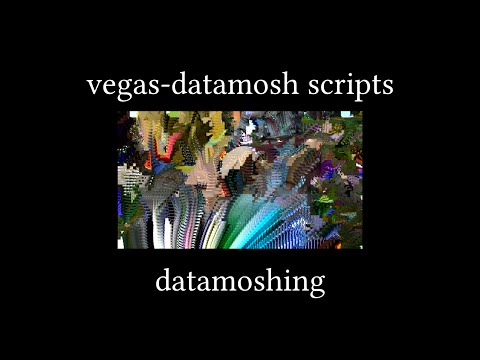

# vegas-datamosh 
**A pack of Sony/MAGIX Vegas Pro scripts for YTP (datamoshing, multilayering, ...), using FFmpeg and Avidemux**

**English** | [简体中文](README_zh-CN.md) | [繁體中文](README_zh-TW.md) | [日本語](README_ja-JP.md) | [Tiếng Việt](README_vi-VN.md)

> Delthas's original repository: https://github.com/delthas/vegas-datamosh

## News
- **1.4.0**: Added Datamix (datamosh: apply a clip P-frames on another clip I-frame)
- **1.3.0**: Added Automator (randomizes video effects)

## Video tutorial
[](https://www.youtube.com/watch?v=6D2lW6H0bb8)
<!-- Raw image link: https://img.youtube.com/vi/6D2lW6H0bb8/0.jpg -->

## Setup
Download the latest [release](../releases/latest) **(the windows64.zip file)** and unpack it into your ```C:\Users\<user>\Documents\Vegas Script Menu``` folder. (If the folder does not exist, create it.)

Several entries will be added in the ```Tools -> Scripting``` submenu in Vegas. For each script, there will two entries, one of which is suffixed by "14" (for example, Datamosh and Datamosh14). If you use Sony Vegas <= 13, use the normal ones (eg Datamosh), otherwise use the ones suffixed by 14 (eg Datamosh14).

You can add scripts as toolbar buttons rather than having to click inside the ```Tools -> Scripting``` submenu, by adding them to the toolbar using the ```Options -> Customize Toolbar``` menu.

**If Sony/MAGIX Vegas complains about not finding the Microsoft.WindowsAPICodePack.dll file, simply restart Vegas and it will work. It just happens from time to time and I don't know how to fix it yet.**

**If you encounter any issue with the scripts, or you have any suggestion, please open an issue on this repository or contact me on Discord at ```cc#6439```.**

> ## Note
> * **I-frame:** Intra Frame
> * **P-frame:** Forward Predicted Frame
> * **B-frame:** Bi-Directional Predictive Frame

## Scripts

### Datamosh
This repeats N P-frames M times. N is the ```Frame count```, M is the  ```Frame repeats```.

To use, make a selection in the timeline using <kbd>I</kbd> and <kbd>O</kbd>, then it will be rendered and datamoshed and added to your project, all in one click. It can take quite some time for long selections so wait if Vegas seems to freeze.

The start of the selection is the first P-frame that will be repeated. The P-frame will be relative to the previous frame, which will be rendered as an I-frame. So for best results, the start of the selection should be a frame with a lot of movement.

The end of the selection simply tells the script until which frame it should render the datamoshed file. The longer the selection, the longer the render time.

### Datamix
This replaces the first I-frames of a clip by a frame of another clip.

To use, make a selection in the timeline using <kbd>I</kbd> and <kbd>O</kbd>, then it will be rendered and datamixed and added to your project, all in one click. It can take quite some time for long selections so wait if Vegas seems to freeze.

The start of the selection is the I-frame of the clip that will be replaced by another I-frame. *The image used for the new I-frame will be the frame just before the start of the selection.* So make sure to place the image you want to datamix from, just before the selection start.

If you want to datamix on a scene change, you can typically split the clip at the exact frame where the scene changes, and select the right clip. This will datamix the right-hand side clip onto the last frame of the left-hand side clip.

The end of the selection simply tells the script until which frame it should render the datamoshed file. The longer the selection, the longer the render time.

### Layer
This does multilayering, by copying the select video clip/event N times, each time offsetting the clip by M frames. N is the ```Layer count```, M is the ```Layering offset```. You can also choose to automatically render the multilayered clip by checking the ```Render``` hitbox, otherwise the copies clips will simply be added to the timeline.

To use, select a single video clip/event, then it will be multilayered automatically, and rendered transparently if specified.

*You can use a negative offset (eg -2 instead of 2), in which case the newest clips/events will be added at the back, instead of the front of the previous events.*

**If you choose to render automatically, the rendered file will support alpha/transparency, meaning you don't need to add a green screen and remove it after, the alpha is handled automatically.**

### Render
This simply renders a part of the timeline and places it into the timeline in a single click.

To use, make a selection in the timeline using <kbd>I</kbd> and <kbd>O</kbd>, then it will be rendered and added to your project, all in one click.

**The rendered file will support alpha/transparency, meaning you don't need to add a green screen and remove it after, the alpha is handled automatically.**

### Scramble
This simply scrambles multiple clips/events, by cutting them in subclips of length N, and shuffling the subclips. N is the ```Scramble size```, and is usually 1.

To use, select several clips/events (they must be actually selected, not only in group-selected), then they will be scrambled automatically.

*Clips starting and ending at the same time will be scrambled together, ie their subclips will be shuffled the same way.*

### Automator
This randomizes the video effects of selected clips/events, by adding random keyframes every frame for each parameter type you select.

To use, select several clips/events which have video effects on them (they must be actually selected, not only in group-selected), then start the script. For each type of video effect parameter on any of the clips, you will be prompted for whether you want the script to *scramble* the parameter (replace all the current keyframes of the parameter with random keyframes), or not (leave the keyframes as is).

**Only *OFX* video effects are supported (newsprint, mirror, ...); they all have the same look, it's easy to identify which effects are OFX. Other effects are ignored.**

## Tips
*On most script window prompts, pressing <kbd>enter</kbd> confirms and pressing <kbd>space</kbd> toggles the checkbox (if present) so you don't even need to use your mouse most of the time.*

## License
All the code is licensed under MIT. The releases include binaries of FFmpeg and Avidemux and the Xvid codec, which are under the LGPL+GPL and GPL and GPL licenses respectively.
