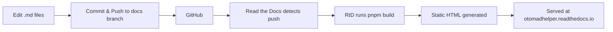

# Otomad Helper Documentation

[](./README.md)
[](./README_zh-CN.md)

Welcome to the documentation repository for **Otomad Helper** — a YTPMV/otoMAD/YTP extension for Vegas Pro. This site serves documentation for both the **new version (v8, an extension)** and the **old version (v4, a script)**.

- 📖 **Live site**: [https://otomadhelper.readthedocs.io/](https://otomadhelper.readthedocs.io/)
- 🗂️ **Source branch**: `docs`

---

## Table of Contents

- [Project Overview](#project-overview)
- [Tech Stack](#tech-stack)
- [Multi-Language Documentation Format](#multi-language-documentation-format)
- [How to Edit Documentation](#how-to-edit-documentation)
  - [One-Time Setup](#one-time-setup)
  - [Daily Editing Workflow](#daily-editing-workflow)
- [Project Structure](#project-structure)
- [How Build & Deployment Works](#how-build--deployment-works)
- [License](#license)

---

## Project Overview

Otomad Helper is a tool that enables Vegas Pro to accept scores (such as MIDI sequence files) as input and automatically generate YTPMV/otoMAD/YTP tracks. This repository contains the **documentation website** source code for the project.

The documentation covers two major versions:

| Version | Type | Description |
|---------|------|-------------|
| **v8** (New) | Extension | The latest version, implemented as a Vegas Pro extension |
| **v4** (Old) | Script | The legacy version, implemented as a script |

## Tech Stack

| Component | Technology |
|-----------|-----------|
| **Documentation Framework** | [VitePress](https://vitepress.dev/) (v2 alpha) |
| **Package Manager** | [pnpm](https://pnpm.io/) |
| **Source Hosting** | [GitHub](https://github.com/otomad/OtomadHelper) (branch: `docs`) |
| **Build & Hosting** | [Read the Docs](https://readthedocs.org/) |
| **Custom Plugins** | i18n-macro, KaTeX math, image preview, pagefind search, RSS feeds, llms.txt |

**How it works:** When code is pushed to the `docs` branch on GitHub, Read the Docs automatically rebuilds the site and serves the static HTML pages at [https://otomadhelper.readthedocs.io/](https://otomadhelper.readthedocs.io/).

## Multi-Language Documentation Format

This project uses a custom **single-file multi-language** format. Instead of maintaining separate files for each language, all translations live together in one file. This makes it much easier to spot and fix errors across languages simultaneously.

### Why This Format?

If the document contains 7 languages, when you need to fix a mistake that exists in multiple languages, the traditional approach requires you to:

1. Open 7 separate files (one per language)
2. Find the corresponding line in each file
3. Make the same fix 7 times

With the single-file format, translations sit right next to each other, so you can fix everything in one place.

### Line-Level Multi-Language

For translating individual lines, use the **`@` prefix** followed by a language tag, a space, and the translated content:

```markdown
@en This is English content.
@zh 这是中文内容。
@ja これは日本語の内容です。
```

Currently supported language tags: `en` (English), `zh` (Simplified Chinese).

### Block-Level Multi-Language

For large blocks of content — such as entire paragraphs with complex formatting, tables, or admonition blocks — use **`@@@` delimiters**:

```markdown
@@@en
This is a large block of English content.
It can span multiple lines and include **formatting**.
@@@zh
这是一大段中文内容。
它可以跨越多行并包含**格式**。
@@@
```

- Start a block with `@@@` followed by a language tag
- End the **entire** multi-language block with a bare `@@@` on its own line

### Fallback Behavior

If a particular language is missing for a line or block, the site will automatically **fall back to English**. This means you only need to write translations for languages you know — missing ones will safely display English instead.

### Important Rules

- **Do not** mix line-level (`@`) and block-level (`@@@`) syntax for the same content — pick one.
- The `@` or `@@@` markers must appear at the very beginning of a line.
- For line-level translations, languages can appear in any order, but keeping them consistent (e.g., always `@en` first, then `@zh`) helps readability.

---

## How to Edit Documentation

The steps below are written for **non-programmers**. You do not need any coding experience — just follow along step by step. If you get stuck, ask a friend who is familiar with computers to help.

> ⚠️ **Important:** All documentation changes should be made on the **`docs`** branch, not the `main`/`master` branch.

### One-Time Setup

You only need to do this section **once**, the first time you set up the project on your computer.

---

#### Step 1: Install Node.js

Node.js is the runtime that powers the documentation toolchain.

1. Open your browser and go to **[https://nodejs.org/](https://nodejs.org/)**
2. Click the **LTS** (Long Term Support) download button — this is the stable version recommended for most users.
3. Once downloaded, double-click the installer file (e.g., `node-vXX.XX.X-x64.msi` on Windows).
4. Follow the installation wizard — you can accept all the default settings.
5. Click **Finish** when done.

> ✅ To verify it's installed: Open the Start Menu, type `cmd`, press Enter to open Command Prompt, then type `node --version`. If you see a version number (e.g., `v22.x.x`), you're all set.

---

#### Step 2: Install pnpm

pnpm is the package manager used by this project.

1. Open **Command Prompt** (Start Menu → type `cmd` → press Enter).
2. Type the following command and press Enter:
   ```
   npm install -g pnpm
   ```
3. Wait for the installation to complete.

> ✅ To verify: type `pnpm --version` in Command Prompt. You should see a version number.

---

#### Step 3: Install GitHub Desktop

GitHub Desktop provides a visual interface for Git, so you don't need to memorize command-line instructions.

1. Go to **[https://desktop.github.com/](https://desktop.github.com/)**
2. Click the **Download** button.
3. Once downloaded, run the installer.
4. When you open GitHub Desktop for the first time, it will ask you to sign in with your GitHub account. If you don't have one:
   - Go to **[https://github.com/signup](https://github.com/signup)** and create a free account.
   - Then sign in to GitHub Desktop with your new account.
5. Follow the setup prompts (you can skip configuring Git if asked — the defaults are fine).

---

#### Step 4: Clone the Repository

"Cloning" means downloading a copy of the project to your computer.

1. In **GitHub Desktop**, click **File → Clone repository...**
2. Select the **URL** tab.
3. In the "Repository URL" field, enter:
   ```
   https://github.com/otomad/OtomadHelper
   ```
4. For "Local path", click **Choose...** and pick a folder on your computer where you want to store the project (e.g., `D:\Documents\OtomadHelper`).
5. Click **Clone**.
6. **Important:** After cloning, switch to the `docs` branch:
   - Near the top of GitHub Desktop, you'll see a button labeled **"Current branch"** (it may say `main` or `master`).
   - Click it, then select the **`docs`** branch from the list.
   - If you don't see `docs` in the list, click the **"Origin"** tab at the top of the branch list — branches that only exist on GitHub will appear there. Click `docs` to check it out.

---

#### Step 5: Install Project Dependencies

Dependencies are external libraries the project needs to work.

1. In **GitHub Desktop**, with the repository open, click **Repository → Open in Terminal** (or press `` Ctrl+` ``).
   - This opens a terminal window already pointing to the project folder.
2. In the terminal, type the following and press Enter:
   ```
   pnpm install
   ```
3. Wait for the installation to finish — it may take a minute or two. You'll see a progress indicator, and it will end with something like "Done".

> You only need to run `pnpm install` once during setup. You generally don't need to run it again unless someone tells you new dependencies were added.

---

#### Step 6 (Recommended): Install Visual Studio Code

While you can edit files with Notepad, **Visual Studio Code (VS Code)** is a free, powerful editor that makes editing much easier with syntax highlighting and file browsing.

1. Go to **[https://code.visualstudio.com/](https://code.visualstudio.com/)**
2. Click **Download** and install it (accept all defaults).
3. After installation, in **GitHub Desktop**, you can right-click the repository and choose **"Open in Visual Studio Code"** to jump straight into editing.

---

### Daily Editing Workflow

This is the workflow you'll follow **each time** you want to make changes.

---

#### Step 1: Pull the Latest Changes

Before editing, always fetch the latest version to avoid conflicts with changes others may have made.

1. Open **GitHub Desktop**.
2. Make sure the current repository is **OtomadHelper** and the current branch is **`docs`**.
3. Click the **"Fetch origin"** button in the top toolbar.
4. If there are new changes, the button will change to **"Pull origin"** — click it to download the latest updates.

> 💡 **Tip:** Always do this before you start editing. It prevents the frustration of having your work overwritten by someone else's changes.

---

#### Step 2: Edit Documentation Files

The documentation files are Markdown (`.md`) files located in the `docs/` folder.

1. Open the project folder in your file explorer, or open it in **VS Code**.
2. Navigate to the `docs/` folder. Inside you'll find:
   - **`.vitepress/`** — Configuration and theme files (usually you won't touch these)
   - **`v4/`** — Documentation for the old v4 script version
   - **`zh-CN/`** — Chinese-specific pages (home page, etc.)
   - **`*.md` files** — The main v8 documentation pages (these use the [multi-language format](#multi-language-documentation-format))
3. Open the file you want to edit. Most content files use the single-file multi-language format, so English and Chinese content sit together. See the [Multi-Language Documentation Format](#multi-language-documentation-format) section above for details.
4. Make your changes and save the file (`Ctrl+S`).

> 📝 **What to edit:**
> - To fix a typo or error: find the `@en` line and edit it. The corresponding `@zh` line(s) are right below.
> - To add a new section: write `@en Your English text` followed by `@zh 你的中文文本` for each paragraph.
> - For large blocks (warnings, tables, etc.), use the `@@@en` / `@@@zh` / `@@@` block format.

---

#### Step 3: Preview Your Changes Locally

Before pushing, you can preview the site on your own computer to see how your changes look.

1. Open a terminal in the project folder:
   - **In VS Code:** Press `` Ctrl+` `` (backtick key, usually below Esc) or go to **Terminal → New Terminal**.
   - **In GitHub Desktop:** Click **Repository → Open in Terminal**.
2. Type this command and press Enter:
   ```
   pnpm run dev
   ```
3. Wait a moment. You'll see output like:
   ```
   vitepress vX.X.X
   ➜  Local:   http://localhost:7000/
   ```
4. Open your browser and go to **`http://localhost:7000/`**.
5. Navigate to the page(s) you edited and check that everything looks correct.
6. When you're done previewing, go back to the terminal and press `Ctrl+C` to stop the preview server.

> 💡 **Tip:** The preview updates automatically as you save files — just save in your editor and refresh the browser.

---

#### Step 4: Commit and Push Your Changes

"Committing" saves your changes to the local repository. "Pushing" uploads them to GitHub.

1. Open **GitHub Desktop**. You'll see your changed files listed on the left.
2. In the bottom-left corner, find the **"Summary"** field. Write a short, clear description of what you changed. For example:
   - `Fix typo in installation guide`
   - `Update audio page with new feature description`
   - `Add Chinese translation for FAQ page`
3. Optionally, you can add more details in the **"Description"** field below.
4. Click the **"Commit to docs"** button.
5. After committing, click the **"Push origin"** button (top right) to upload your changes to GitHub.

> 🎉 That's it! Once pushed, Read the Docs will automatically rebuild the site within a few minutes. You can check the live site at [https://otomadhelper.readthedocs.io/](https://otomadhelper.readthedocs.io/).

---

## Project Structure

```
OtomadHelper/                          # Repository root (docs branch)
├── .gitignore                         # Files ignored by Git
├── .readthedocs.yaml                  # Read the Docs build configuration
├── package.json                       # Project dependencies and scripts
├── pnpm-lock.yaml                     # Dependency version lock file
├── tsconfig.json                      # TypeScript configuration
├── oxfmt.config.ts                    # Code formatter configuration
├── README.md                          # You are here
├── README_zh-CN.md                    # Chinese version of this file
└── docs/                              # Documentation source (VitePress root)
    ├── .vitepress/                    # VitePress configuration & theme
    │   ├── config.ts                  # Main site configuration
    │   ├── components/                # Custom Vue components
    │   ├── plugins/                   # Custom Markdown & build plugins
    │   ├── theme/                     # Custom theme overrides
    │   └── use-i18n.ts               # Internationalization helpers
    ├── assets/                        # Static assets (images, fonts, etc.)
    ├── img/                           # Documentation images
    ├── public/                        # Public static files
    │   ├── favicon.svg               # Site favicon
    │   └── favicon_1.ico             # Alternative favicon (RtD workaround)
    ├── index.md                       # Home page (English)
    ├── introduction.md                # Introduction page (multi-language)
    ├── installation.md                # Installation guide (multi-language)
    ├── usage.md                       # Usage guide (multi-language)
    ├── faq.md                         # FAQ (multi-language)
    ├── audio.md, visual.md, ...       # Feature pages (multi-language)
    ├── v4/                            # Old v4 documentation pages
    │   ├── introduction.md
    │   ├── installation.md
    │   └── ...
    └── zh-CN/                         # Chinese-specific pages
        ├── index.md                   # Home page (Chinese)
        └── v4/                        # Chinese v4 entry point
```

---

## How Build & Deployment Works



1. You edit Markdown files and push to the `docs` branch on GitHub.
2. Read the Docs automatically detects the push.
3. RtD runs `npm run build` (configured in `.readthedocs.yaml`), which builds the VitePress site.
4. The generated static HTML files are served at [https://otomadhelper.readthedocs.io/](https://otomadhelper.readthedocs.io/).
5. The build usually completes within **2–5 minutes** after pushing.

### Available Scripts

| Command | Description |
|---------|-------------|
| `pnpm run dev` | Start a local preview server at `http://localhost:7000/` |
| `pnpm run build` | Build the static site for production |
| `pnpm run preview` | Preview the production build locally |
| `pnpm run fmt` | Format code with oxfmt |

---

## License

This documentation is released under the [GPL 3.0 License](https://www.gnu.org/licenses/gpl-3.0.html).

Copyright © 2021–present
