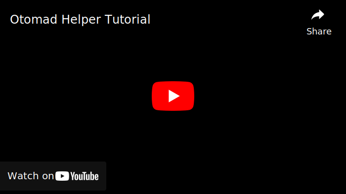

	<h2 id="otomad-helper">Otomad Helper</h2>
	
<b><i>Ranne</i></b>

	

[English](README.md) | [简体中文](README_zh-CN.md) | [繁體中文](README_zh-TW.md) | [日本語](README_ja-JP.md) | [Tiếng Việt](README_vi-VN.md) | **Bahasa Indo**

**Otomad Helper** untuk **Vegas**, yang dirancang untuk menerima file MIDI sebagai input, dan secara otomatis membuat trek YTPMV/Otomad.

Skrip ini dibikin oleh orang keren, yaitu si [@Chaosinism](https://github.com/Chaosinism)'s open source code dan menggunakan NAudio library.

Skrip ini juga bisa membuat YTP, Efek sonar, Datamosh. And Lirik/Karaoke, Manual Vocaloid/Sentence Mixing, Shupelunker Tactics, dll. tapi itu akan ada di update selanjutnya.

Toko akan didukung untuk mengunduh templat terkait di masa mendatang.

Fitur YTP mengacu pada [YTP+](https://github.com/YTP-Plus).

Datą̬͉̫̐͑̓̄ͅa̸͎͇͗̌͂̈̀ą̸̝̼̦̤̇̐ǎ̛͍́̑a̸̲͙͛̐̄̎̚͜a̢̨̝̟͎̾̔̊ǎ̤̞͈͑a͈̪̣̍mo̻̪̬̘̲͆͂͠o̸͍̞͔̓̆̊̀o̗͊̇̇̈́̇ǫ͇͗̏̕͜ơ̬͍͚̦̯̓̊͌ò͈̦̫̈́̓o̦̣̲̊̀o̪̪͚̺̘͛̽̏̈́sh ada teknik yang membuat video kalian jadi ancur dan nge-glitch. Fitur terkait dari Datamosh mengacu pada [vegas-datamosh](https://github.com/delthas/vegas-datamosh).

Fitur terkait dari Camera shake mengacu pada [VegasShakeScript](https://github.com/tmarplatt/VegasScripts).

**Projek sambungan:** [om midi untuk After Effects](https://github.com/otomad/om_midi).

### Penerjemah
* Penerjemahan Bahasa Vietnam: [@Cyahega](https://github.com/Cyahega).
* Penerjemahan Bahasa Indonesia: [@AdeEdogawa](https://github.com/AdeEdogawa) & @JujunG.

### Pengunaan
Pilih trek source di trek jendela (maksudnya di timeline), atau pilih trek source di projecy media atau telusuri file media lain (dalam formulir konfigurasi skrip), lalu bukan skripnya untuk ngatur dan generate.

Kalian bisa menambahkan skrip sebagai tombol toolbar daripada harus mengeklik di dalam submenu *Tools > Scripting*, dengan menambahkannya ke toolbar menggunakan menu *Options > Customize Toolbar*.

Kalian bisa baca ini: [@Evauation](https://github.com/Evauation)'s [documentation](https://docs.google.com/document/d/1PEkh0_WFDLUAYGD-YzIDNXUQiAKqogEvpuRQhfqz9ng) dan nonton video ini: [@Cassidy](https://github.com/composition-cassidy)'s [tutorial video](https://www.youtube.com/watch?v=8vSpzgL_86A) *(Inggris)*.

[tekan sini untuk intruksi Datamosh](Datamosh/README.md). atau nonton [watch the video](https://www.youtube.com/watch?v=6D2lW6H0bb8) *(Inggris)*.

### Instalasi
1. [Download](https://github.com/otomad/OtomadHelper/releases/latest) versi terbaru.
2. Unzip (Ekstrak) **Semua** file di dalam zip file yang barusan kalian download ke folder "Script Menu" (Lokasinya di tempat folder Vegas).
> (yaitu. C:\\Program Files\\VEGAS\\VEGAS Pro 20.0\\Script Menu)
3. Pastikan file DLL-nya `(DLL\NAudio.dll)` ga terlock. **Langkah spesifik:**
	1. Di direktori instalasi Vegas, masukkan folder `Script Menu\DLL`.
	2. Klik kanan file NAudio.dll dan pilih properties.
	3. Jika kalian ngeliat ada tombol "Unblock" (Windows 7/8.x) atau checkbox (Windows 10+), click dan cek itu.
	4. Tekan tombol "OK" jika sudah selesai.
4. Buka Vegas pro dan ke menu *Tools > Scripting > Otomad Helper* untuk menjalankan skripnya.

#### Datamosh paket ekstensi
Kalo mau make Datamosh kalian harus download ekstensinya

1. Ekstensi Datamosh: [Download](https://github.com/otomad/OtomadHelper/releases/tag/v1.0-datamosh).
2. Ekstrak filenya ke `_internal` folder yang sama dengan `Otomad Helper.cs`.

### **Kompatibilitas**
Vegas Pro 13+ didukung.

Vegas Pro 16 dan versi keatas mendukung semua fitur, dan Vegas Pro 13 ~ 15 kompatibel untuk dijalankan (beberapa fitur hilang). Versi yang benar harus diinstal.

Telah di uji **bisa** di Vegas Pro 17, 18, 19, 20.

### Glossary
Kalian dapat mempelajari banyak fitur dengan lebih mudah melalui gambar.

[Glossary >](glossary.md)

### Tutorial

 <small>[Eksplor efek Visual](https://youtu.be/cY2Qa3Owetw)</small>

### Riwayat update
Ini adalah screenshot dari antarmuka pengguna skrip untuk pembaruan versi utama dalam histori.

[Riwayat update >](history/README.md)

### Roadmap
[Pergi ke Proyek GitHub >](https://github.com/users/otomad/projects/2)

### Issues
Kalian memakai skrip ini? dan kalian:
1. Error;
2. Ketemu bug;
3. Saran ide baru;
4. Berkolaborasi dalam produksi;
5. Mengoptimalkan tampilan antarmuka;
6. Mengkoreksi terjemahan;
7. Menyediakan bahasa baru;
8. …

Kalian bisa bikin Issues.

### Syarat penggunaaan
1. Hormati hak dan kepentingan pencipta saat berkreasi dengan MIDI/soruce yang bukan buatan sendiri.
2. Menggunakan skrip ini memerlukan beberapa kemampuan kreatif dari pengguna. Skrip ini harus dan hanya boleh digunakan untuk membantu pembuatan. Jangan hanya mengandalkan skrip ini untuk membuat atau belajar membuat Otomad/YTPMV sebagai pemula. Dengar, jangan buat Otomidi!

### Izin
Jika Kalian menggunakan skrip ini, skrip akan menggunakan izin berikut.
1. File read and write. 
	Skrip membaca dan mengedit profil pengguna INI di memori disk Anda untuk menyimpan data pengguna Kalian.
	> Path: C:\\Users\\*(Nama penggunamu)*\\AppData\\Roaming\\VEGAS Pro\\*(Versi Vegas anda)*\\Otomad Helper.ini
2. Registry read and write. 
	Skrip perlu membaca dan mengedit registry untuk menginstal atau menghapus preset plugin pitch-shift.
	> Path: HKEY_CURRENT_USER\\Software\\DirectShow\\Presets\\{ED1B4100-93BE-11D0-AEBC-00A0C9053912}
	
	Konfigurasi yang terkait dengan Datamosh disimpan dalam registry.
	> Path: HKEY_CURRENT_USER\\SOFTWARE\\VEGAS Creative Software\\Custom Presets

### Refrensi
* [Chaosinism's **Original** Otomad Helper Script](https://github.com/Chaosinism/vegas_scripts)
* [Evan Kale's **Vegas Scripts**](https://github.com/evankale/VegasScripts)
* [Mark Heath's **NAudio** .NET Audio Library](https://github.com/naudio/NAudio)
* [Ben Brown, Kiwifruitdev, Nuppington's **YTP+**](https://github.com/YTP-Plus)
* [Edward's **JETDV** Scripts](https://www.jetdv.com/)
* [Vegas Pro Scripting **Forum**](https://www.vegascreativesoftware.info/us/vegas-pro-forum/scripting/)
* [Opulos's **Alpha Color Dialog**](https://sourceforge.net/projects/alpha-color-dialog/)
* [Ookii Dialogs WinForms **Progress Dialog**](https://github.com/ookii-dialogs/ookii-dialogs-winforms)
* [Delthas's **Vegas Datamosh**](https://github.com/delthas/vegas-datamosh)
* [Tmarplatt's **VegasShakeScript**](https://github.com/tmarplatt/VegasScripts)

<!-- ### Logo
Inspirasi oleh:
* [@Hibato Sakuno](https://space.bilibili.com/13084550)
* [@Sufei-King](https://space.bilibili.com/8569439) -->

### Bantuan dan Pemecahan Masalah
**Dokumentasi:** *(Cina)*
* [Melepaskan catatan (v4.9.25.0)](https://www.bilibili.com/read/cv13335178)
* [Melepaskan catatan (v4.10.17.0)](https://www.bilibili.com/read/cv13614419)

**Doksli Chaosinism:** *(Cina)*
* [Dokumentasi (v0.1) (bilibili)](https://www.bilibili.com/read/cv392013)
* [Dokumen untuk Staff Visualizer (v0.1)](https://www.bilibili.com/read/cv1027442)
* [Membuat masalah](https://www.bilibili.com/read/cv495309)
* [Video tutorial (v0.1)](https://www.bilibili.com/video/av22226321)

**Doksli Chaosinism:** *(Jepang)*
* [Dokumentasi (v0.1) (bowlroll)](https://bowlroll.net/user/261124)

### Lisensi
| Proyek | Lesen |
| ---- | ---- |
| Otomad Helper *Proyek ini* | GPL 3.0 |
| otomad_helper *Skrip asli Chaosinism* | LGPL 3.0 |
| VegasScripts *Skrip Evan Kale* | GPL 3.0 |
| NAudio | MIT |
| YTP+ | GPL 3.0 |
| Alpha Color Dialog | BSD |
| Ookii Dialogs WinForms | BSD 3 Clause |
| vegas-datamosh | MIT |
| FFmpeg | LGPL + GPL |
| Avidemux | GPL |
| Xvid codec | GPL |

<!-- ---

 
<h2 align="center">General Instructions (for commonly all scripts)</h2>

### Tips
Berbagai skrip untuk MAGIX Vegas **(v14 ke atas)**.

Catatan kompilasi untuk Sony Vegas **(v13 ke bawah)**:
* Nama namespace dari *.NET Assembly* telah berubah dari `Sony.Vegas` menjadi `ScriptPortal.Vegas` di **v14 dan seterusnya**.
* Ubah **`using ScriptPortal.Vegas;`** menjadi **`using Sony.Vegas;`** dalam skrip untuk dikompilasi untuk **v13**.
* Sebenarnya, skrip tidak didukung **v12 ke bawah**.

### Instalasi
* Skrip termasuk dalam direktori instalasi Vegas, di folder "Menu Skrip".
	* (yaitu. C:\\Program Files\\VEGAS\\VEGAS Pro 20.0\\Script Menu)
* Beberapa skrip memerlukan DLL tambahan, letakkan di folder "DLL" di folder "Menu Skrip".
	* (yaitu. C:\\Program Files\\VEGAS\\VEGAS Pro 20.0\\Script Menu\\DLL)
* Ingat! file dll jangan lupa di Unblock. -->

