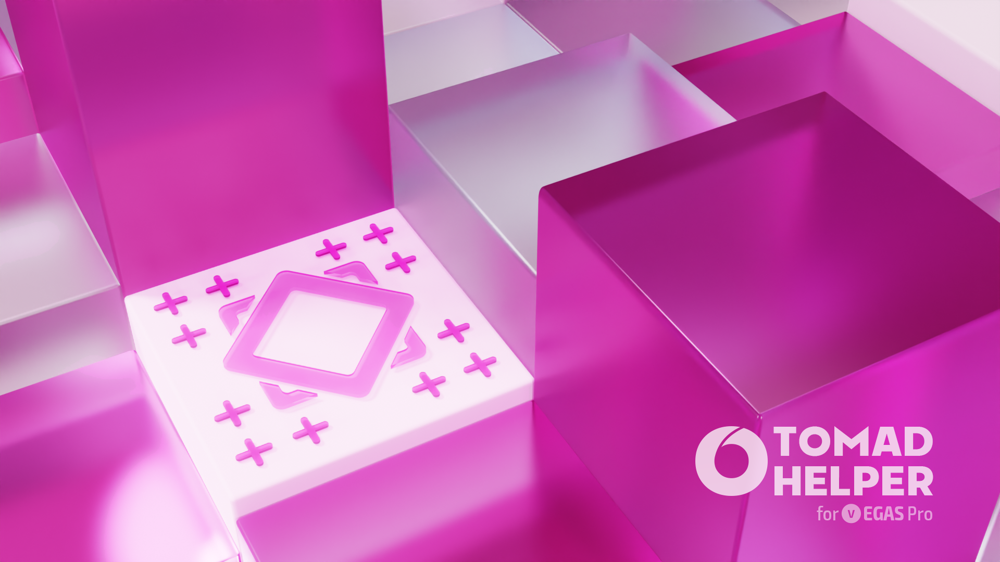
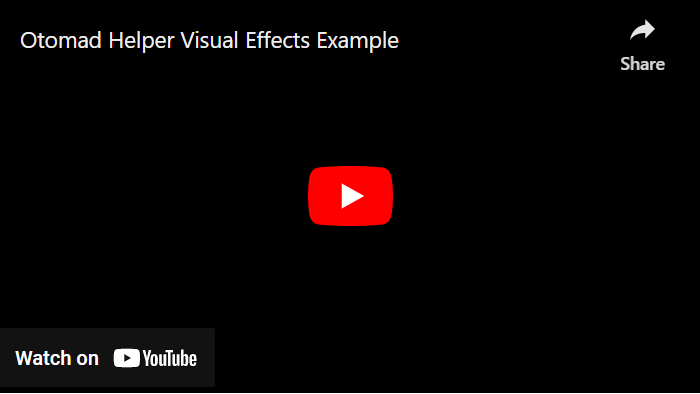

	<h2 id="otomad-helper">音 MAD ヘルパー</h2>
	
<b>蘭音</b>

	

[EN](README.md) | [简中](README_zh-CN.md) | [繁中](README_zh-TW.md) | **日** | [VI](README_vi-VN.md)

**音 MAD ヘルパー Vegas**、Vegas が MIDI シーケンスファイルを入力として受け入れ、音 MAD / YTPMV トラックを自動的に生成できるように設計されています。

このスクリプトは、元の作成者[@カオシニズム](https://github.com/Chaosinism)のオープンソースコードの二次開発に基づいており、NAudio ライブラリを使用しています。

YTP・ソナー効果・データモッシュを作成することも可能です。将来的には歌詞/カラオケ・ボカロ/鬼畜・シュペランカー戦法の作成にも使用できます。

将来的には、他のユーザーが作成したテンプレートやその他の関連資料をダウンロードするためのストア機能が追加される予定です。

YTP の関連機能は [YTP+](https://github.com/YTP-Plus) から参照。

縺ﾃﾞ繧ｰﾀ繝ﾓ譌ｯ縲｢ｼ譛ｭ･はクリップに損傷を与えてグリッチ効果を作成する技術です。データモッシュの関連機能は [Vegas データモッシュ](https://github.com/delthas/vegas-datamosh) から参照。

手ぶれ機能とは [Vegas シェイク スクリプト](https://github.com/tmarplatt/VegasScripts) から参照。

ベトナム語翻訳は[@シャヘガ](https://github.com/Cyahega)によって提供されている。

**姉妹プロジェクト：**[om_midi for After Effects](https://github.com/otomad/om_midi)。

### 使用法
「トラック」ウィンドウでクリップを選択するか、「プロジェクトメディア」ウィンドウでクリップを選択するか、手動で参照して他のクリップを選択します（「スクリプト」ウィンドウを開いた後）。その後、スクリプト構成を開いて生成できます。

メニューで *オプション > ツールバーのカスタマイズ* を選択して、簡単な操作のためにスクリプトをツールバーに追加できます。

[@イーユエーション](https://github.com/Evauation)の[ドキュメンテーション](https://docs.google.com/document/d/1PEkh0_WFDLUAYGD-YzIDNXUQiAKqogEvpuRQhfqz9ng/edit)を読んだり、[@キャシディ](https://github.com/composition-cassidy)の[チュートリアルビデオ](https://www.youtube.com/watch?v=8vSpzgL_86A)を視聴したりすることもできます<wbr />*（英語）*。

データモッシュの使用方法については、[ここをクリックしてください](Datamosh/README.md)。[ビデオを見る](https://www.youtube.com/watch?v=6D2lW6H0bb8)こともできます<wbr />*（英語）*。

### インストール
1. スクリプトの最新バージョンを[ダウンロード](https://github.com/otomad/OtomadHelper/releases/latest)します。
2. ZIP ファイル内の**すべて**のファイルを解凍し、Vegas インストールディレクトリの下の「スクリプトメニュー」フォルダに配置します。
> (例えば：C:\\Program Files\\VEGAS\\VEGAS Pro 20.0\\Script Menu)
3. DLL ファイル `(DLL\NAudio.dll)` がロックされていないことを確認してください。**具体的な手順：**
	1. Vegas のインストールディレクトリで、`Script Menu\DLL` フォルダを順番に入力します。
	2. NAudio.dll ファイルを右クリックし、［プロパティ］を選択します。
	3. ［ロック解除］ボタンまたはチェックボックスが表示されている場合は、クリックまたはチェックします。
	4. ［OK］ボタンをクリックすると、完了です。
4. Vegas Pro を開いてスクリプトを開始します。メニューの *ツール > スクリプト > Otomad Helper* を選択します。

#### データモッシュ拡張パッケー
データモッシュのすべての機能を使用する必要がある場合は、データモッシュ拡張パッケージをインストールする必要があります。

1. データモッシュ拡張パックを[ダウンロード](https://github.com/otomad/OtomadHelper/releases/tag/v1.0-datamosh)します。
2. 7Z ファイルを解凍し、`_internal` フォルダーをスクリプト `Otomad Helper.cs` と同じディレクトリに移動します。

### **互換性**
Vegas Pro 13 以降をサポートします。

Vegas 16 以降はすべての機能をサポートしており、Vegas 13〜15 は互換性のある実行が可能です（一部の機能が欠落しています）。対応するバージョンをインストールする必要があることが前提です。

Vegas Pro 17、18、19、20 で**正常**にテストされました。

### 用語集
多くの機能について、写真を通してより簡単に知ることができます。

[用語集 >](glossary.md)

### 視覚効果の探索

### メジャーバージョン更新履歴
これらは、履歴のメジャー バージョン アップデートのスクリプト ユーザー インターフェイスのスクリーンショットです。

[メジャーバージョン更新履歴 >](history/README.md)

### ロードマップ
[ロードマップ >](roadmap.md)

### 問題
スクリプトを使用する場合、次の場合：
1. 問題が発生しました；
2. バグを見つけました；
3. 新しい提案やアイデアがあります；
4. プロジェクトの維持を支援する；
5. インターフェイスの外観を最適化する；
6. 翻訳の問題を修正する；
7. 新しい翻訳を送信する；
8. ……

「issues」を提出できます。

### 利用規約
1. 非自作 MIDI / 素材を使用して創作する場合は、その作者の権益を尊重してください。
2. 本スクリプトを使用すると、使用者は一定の創作能力を満たす必要があり、本スクリプトは補助的に創作するために使用されるべきである。本スクリプトだけで作品を生成したり、初心者として創作音 MAD / YTPMV を学習したりしてはいけません。従順で、音 MIDI を作らないでください！

### 権限
スクリプトを使用する場合、次の権限が使用されます。
1. ファイルの読み取りと書き込み。 
	スクリプトは、ユーザー構成設定を保持するファイルをディスク上に作成します。
	> パス：C:\\Users\\*(あなたのユーザーネーム)*\\AppData\\Roaming\\VEGAS Pro\\*(Vegas バージョン)*\\Otomad Helper.ini
2. レジストリの読み取りと書き込み。 
	ピッチシフトプラグインプリセットをインストールまたはアンインストールするには、スクリプトでレジストリを読み書きする必要があります。 
	ピッチシフトプラグインのチューニングアルゴリズムを使用しない場合は、この権限を無視できます。
	> パス：HKEY_CURRENT_USER\\Software\\DirectShow\\Presets\\{ED1B4100-93BE-11D0-AEBC-00A0C9053912}

### 参考
* [カオシニズムの**元**の音 MAD ヘルパー スクリプト](https://github.com/Chaosinism/vegas_scripts)
* [エヴァン・ケールの **Vegas スクリプト集**](https://github.com/evankale/VegasScripts)
* [マーク・ヒースの **NAudio** .NET オーディオ ライブラリ](https://github.com/naudio/NAudio)
* [ベン・ブラウン、キウイフルーツ開発、ニュッピントンの **YTP+**](https://github.com/YTP-Plus)
* [エドワードの **JETDV** スクリプト集](https://www.jetdv.com/)
* [Vegas Pro スクリプト **フォーラム**](https://www.vegascreativesoftware.info/us/vegas-pro-forum/scripting/)
* [オプロスの**アルファ付きカラーピッカー**](https://sourceforge.net/projects/alpha-color-dialog/)
* [大きい ダイアログ ウィンフォームの**進捗ダイアログ**](https://github.com/ookii-dialogs/ookii-dialogs-winforms)
* [デルタスの **Vegas データモッシュ**](https://github.com/delthas/vegas-datamosh)
* [トゥマープラットの **Vegas シェイク スクリプト**](https://github.com/tmarplatt/VegasScripts)

### アイコン
に触発された：
* [@氷鳩さくの](https://space.bilibili.com/13084550)
* [@酥妃大魔王](https://space.bilibili.com/8569439)

### ヘルプとトラブルシューティング
**私のドキュメンテーション：***（中国語）*
* [リリースノート (v4.9.25.0)](https://www.bilibili.com/read/cv13335178)
* [リリースノート (v4.10.17.0)](https://www.bilibili.com/read/cv13614419)

**カオシニズムの元のドキュメンテーション：***（中国語）*
* [ドキュメンテーション (v0.1) (ビリビリ)](https://www.bilibili.com/read/cv392013)
* [ステーブ視覚化のドキュメンテーション (v0.1)](https://www.bilibili.com/read/cv1027442)
* [トラブルシューティング](https://www.bilibili.com/read/cv495309)
* [チュートリアルビデオ (v0.1)](https://www.bilibili.com/video/av22226321)

**カオシニズムの元のドキュメンテーション：***（日本語）*
* [ドキュメンテーション (v0.1) (ボウルロール)](https://bowlroll.net/user/261124)

### ライセンス
* このプロジェクトは GPL 3.0 に準拠しています。
	* カオシニズムのオリジナルスクリプトは、LGPL 3.0 に準拠しています。
		* エヴァン・ケールのスクリプトは GPL 3.0 に準拠しています。
			* NAudio は MIT に準拠しています。
* YTP+ は GPL 3.0 に準拠しています。
* 大きい ダイアログ ウィンフォームは BSD 3 Clause に準拠しています。
* デルタスの Vegas データモッシュ は under the MIT に準拠しています。
	* FFmpeg は LGPL + GPL に準拠しています。
	* Avidemux は GPL に準拠しています。
	* Xvid codec は GPL に準拠しています。

