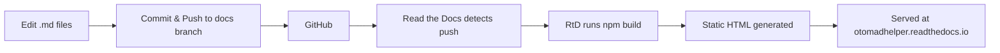
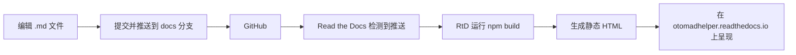

@en # Revise _Otomad Helper_ Documentation
@zh # 修订_音MAD助手_说明文档

@en Welcome to revise the documentation for **Otomad Helper** — a YTPMV/otoMAD/YTP extension for Vegas Pro. This site serves documentation for both the **new version (v8, an extension)** and the **old version (v4, a script)**.
@zh 欢迎修订**音MAD助手（Otomad Helper）**的说明文档——一个Vegas Pro的音MAD/YTPMV/YTP扩展程序。本站点同时涵盖了**新版（v8，扩展程序）**和**旧版（v4，脚本）**的说明文档内容。

@en ## Project Overview
@zh ## 项目概述

@en Otomad Helper is a tool that enables Vegas Pro to accept scores (such as MIDI sequence files) as input and automatically generate YTPMV/otoMAD/YTP tracks. This repository contains the **documentation website** source code for the project.
@zh 音MAD助手是一个使Vegas Pro能够接受乐谱（如MIDI序列文件）作为输入并自动生成音MAD/YTPMV/YTP轨道的工具。本仓库包含该项目的**说明文档网站**源代码。

@en The documentation covers two major versions:
@zh 文档涵盖两个主要版本：

@en | Version | Type | Description |
@zh | 版本 | 类型 | 说明 |
|---------|------|-------------|
@en | <nobr>**v8** (New)</nobr> | Extension / Custom Command | The latest version, implemented as a Vegas Pro extension (aka custom command) |
@zh | <nobr>**v8**（新版）</nobr> | 扩展程序/自定义命令 | 最新版本，以Vegas Pro扩展程序（也被称为自定义命令）的形式实现 |
@en | <nobr>**v4** (Old)</nobr> | Script | The legacy version, implemented as a Vegas Pro script |
@zh | <nobr>**v4**（旧版）</nobr> | 脚本 | 旧版，以Vegas Pro脚本的形式实现 |

@en ## Tech Stack
@zh ## 技术架构

@en | Component | Technology |
@zh | 组件 | 技术 |
|-----------|-----------|
@en | **Documentation Framework** | [VitePress](https://vitepress.dev/) (v2) |
@zh | **文档框架** | [VitePress](https://vitepress.dev/)（v2） |
@en | **Package Manager** | [pnpm](https://pnpm.io/) |
@zh | **包管理器** | [pnpm](https://pnpm.io/) |
@en | **Source Hosting** | [GitHub](https://github.com/otomad/OtomadHelper) (branch: `docs`) |
@zh | **源码托管** | [GitHub](https://github.com/otomad/OtomadHelper)（分支: `docs`） |
@en | **Build & Hosting** | [Read the Docs](https://readthedocs.org/) |
@zh | **构建与托管** | [Read the Docs](https://readthedocs.org/) |
@en | **Custom Plugins** | i18n-macro, KaTeX math, image preview, pagefind search, RSS feeds, llms.txt, etc. |
@zh | **自定义插件** | i18n-macro、KaTeX数学公式、图片预览、pagefind搜索、RSS订阅源、llms.txt，等 |

@en **How it works:** When code is pushed to the `docs` branch on GitHub, Read the Docs automatically rebuilds the site and serves the static HTML pages at [https://otomadhelper.readthedocs.io/](https://otomadhelper.readthedocs.io/).
@zh **工作流程：** 当代码推送到GitHub的`docs`分支后，Read the Docs服务器会自动重新构建项目，并生成静态HTML网页。用户可通过 [https://otomadhelper.readthedocs.io/zh-CN/](https://otomadhelper.readthedocs.io/zh-CN/) 直接阅读最新文档内容。

@en ## Multi-Language Documentation Format
@zh ## 单文件多语言文档格式

@en This project uses a custom **single-file multi-language** format. Instead of maintaining separate files for each language, all translations live together in one file. This makes it much easier to spot and fix errors across languages simultaneously.
@zh 本项目采用了一种创新的**单文件多语言**格式。与传统的每种语言单独维护一个文件不同，所有语言的翻译都写在同一个文件中。这样当需要修改错误时，可以同时看到所有语言的对应内容，一次性全部修正。

@en ### Why This Format?
@zh ### 为什么使用这种格式？

@en If the document contains 7 languages, when you need to fix a mistake that exists in multiple languages, the traditional approach requires you to:
@zh 传统的多语言文档方式中，如果文档包含7种语言，修改一个错误需要：

@en 1. Open 7 separate files (one per language).
@zh 1. 同时打开7个文件（每种语言一个）。
@en 2. Find the corresponding line in each file.
@zh 2. 在每个文件中找到错误内容所在的行。
@en 3. Make the same fix 7 times.
@zh 3. 逐个文件修改同样的内容。

@en With the single-file format, translations sit right next to each other, so you can fix everything in one place.
@zh 使用单文件多语言格式后，各语言的翻译紧挨在一起，可以在同一个位置一次性修改所有语言。

@en ### Line-Level Multi-Language
@zh ### 行多语言

@en For translating individual lines, use the **`@` prefix** followed by a language tag, a space, and the translated content:
@zh 以行为单位为其编写多语言翻译。格式以一个 **`@`符号**开头，后面紧跟着语言标签，空一格后填写该语言在本行的翻译内容：

```markdown
\@en This is English content.
\@zh 这是中文内容。
\@ja これは日本語の内容です。
```

@en Currently supported language tags: `en` (English), `zh` (Simplified Chinese).
@zh 目前支持的语言标签：`en`（英语）、`zh`（简体中文）。

@en ### Block-Level Multi-Language
@zh ### 块多语言

@en For large blocks of content — such as entire paragraphs with complex formatting, tables, or admonition blocks — use **`@@@` delimiters**:
@zh 以块为单位为其编写多语言翻译。适用于大量内容差异或复杂格式的多语言翻译，例如整个表格、警告框等。格式以**三个`@`符号**开头，后面紧跟语言标签：

```markdown
\@@@en
This is a large block of English content.
It can span multiple lines and include **formatting**.
\@@@zh
这是一大段中文内容。
它可以跨越多行并包含**格式**。
\@@@
```

@en - Start a block with `@@@` followed by a language tag.
@zh - 用 `@@@` 加语言标签开始一个块。
@en - End the **entire** multi-language block with a bare `@@@` on its own line.
@zh - 用单独的 `@@@`（不跟标签）结束整个多语言块。

@en ### Fallback Behavior
@zh ### 回退机制

@en If a particular language is missing for a line or block, the site will automatically **fall back to English**. This means you only need to write translations for languages you know — missing ones will safely display English instead.
@zh 如果在某一段行多语言或块多语言内容中缺少编写了某种语言的翻译内容，网站会**自动回退显示为英文文档内容**。这意味着你只需要为你会说的语言编写翻译，缺失的语言会自动安全地显示英文。

@en ### Important Rules
@zh ### 重要规则

@en - **Do not** mix line-level (`@`) and block-level (`@@@`) syntax for the same content — pick one.
@zh - **不要**将行多语言（`@`）和块多语言（`@@@`）语法混用于同一段内容——选择其中一种即可。
@en - The `@` or `@@@` markers must appear at the very beginning of a line.
@zh - `@`或`@@@`标记必须出现在一行的最开头。
@en - For line-level translations, languages can appear in any order, but keeping them consistent (e.g., always `@en` first, then `@zh`) helps readability.
@zh - 对于行多语言翻译，语言的出现顺序可以任意，但保持统一的顺序（例如始终`@en`在前、`@zh`在后）有助于提高可读性。

@en ## How to Edit Documentation
@zh ## 如何编辑文档

@en The steps below are written for **non-programmers**. You do not need any coding experience — just follow along step by step. If you get stuck, ask a friend who is familiar with computers to help.
@zh 以下步骤是为**非程序员**编写的。你不需要任何编程经验，只需一步步跟着操作即可。如果遇到困难，可以请熟悉电脑的朋友帮忙。

::: important
@en All documentation changes should be made on the **`docs`** branch, not the `main`/`master` branch.
@zh 所有文档修改都应在 **`docs`** 分支上进行，而不是 `main`/`master` 分支。
:::

@en ### One-Time Setup
@zh ### 一次性准备工作

@en You only need to do this section **once**, the first time you set up the project on your computer.
@zh 以下步骤仅需**在第一次配置项目时做一次**，以后无需重复。

---

@en #### Step 1: Install Node.js
@zh #### 第一步：安装 Node.js

@en Node.js is the runtime that powers the documentation toolchain.
@zh Node.js 是运行文档工具链所需的运行时环境。

@en 1. Open your browser and go to **[https://nodejs.org/](https://nodejs.org/)**
@zh 1. 打开浏览器，访问 **[https://nodejs.org/](https://nodejs.org/)**
@en 2. Click the **LTS** (Long Term Support) download button — this is the stable version recommended for most users.
@zh 2. 点击 **LTS**（长期支持版）下载按钮——这是推荐大多数用户使用的稳定版本。
@en 3. Once downloaded, double-click the installer file (e.g., `node-vXX.XX.X-x64.msi` on Windows).
@zh 3. 下载完毕后，双击安装文件（Windows上为 `node-vXX.XX.X-x64.msi`）。
@en 4. Follow the installation wizard — you can accept all the default settings.
@zh 4. 按照安装向导操作——可以全部使用默认设置。
@en 5. Click **Finish** when done.
@zh 5. 点击**完成**。

@en ::: info To verify it's installed
@zh ::: info 验证是否安装成功
@en Open the Start Menu, type `cmd`, press [[Enter]] to open Command Prompt, then type `node --version`. If you see a version number (e.g., `v22.x.x`), you're all set.
@zh 打开开始菜单，输入 `cmd`，按回车打开命令提示符，输入 `node --version`。如果看到版本号（例如 `v22.x.x`），说明安装成功。
:::

---

@en #### Step 2: Install pnpm
@zh #### 第二步：安装 pnpm

@en pnpm is the package manager used by this project.
@zh pnpm 是本项目使用的包管理器。

@en 1. Open **Command Prompt** (Start Menu → type `cmd` → press [[Enter]]).
@zh 1. 打开**命令提示符**（开始菜单 → 输入 `cmd` → 按回车）。
@en 2. Type the following command and press [[Enter]]:
@zh 2. 输入以下命令并按回车：
   ```bash
   npm install -g pnpm
   ```
@en 3. Wait for the installation to complete.
@zh 3. 等待安装完成。

@en ::: info To verify
@zh ::: info 验证
@en Type `pnpm --version` in Command Prompt. You should see a version number.
@zh 在命令提示符中输入 `pnpm --version`，应能看到版本号。
:::

---

@en #### Step 3: Install GitHub Desktop
@zh #### 第三步：安装 GitHub Desktop

@en GitHub Desktop provides a visual interface for Git, _so you don't need to memorize command-line instructions._
@zh GitHub Desktop 提供了 Git 的图形化界面，_这样你就不需要记忆和输入 Git 命令行指令了。_

@en 1. Go to **[https://desktop.github.com/](https://desktop.github.com/)**
@zh 1. 访问 **[https://desktop.github.com/](https://desktop.github.com/)**
@en 2. Click the **Download** button.
@zh 2. 点击**下载**按钮。
@en 3. Once downloaded, run the installer.
@zh 3. 下载完成后，运行安装程序。
@en 4. When you open GitHub Desktop for the first time, it will ask you to sign in with your GitHub account. If you don't have one:
@zh 4. 首次打开 GitHub Desktop 时，会要求你登录 GitHub 账号。如果你还没有账号：
@en    - Go to **[https://github.com/signup](https://github.com/signup)** and create a free account.
@zh    - 访问 **[https://github.com/signup](https://github.com/signup)** 创建一个免费账号。
@en    - Then sign in to GitHub Desktop with your new account.
@zh    - 然后用新账号登录 GitHub Desktop。
@en 5. Follow the setup prompts (you can skip configuring Git if asked — the defaults are fine).
@zh 5. 按照设置提示操作（对于Git配置相关的提示可以使用默认设置直接跳过）。

---

@en #### Step 4: Clone the Repository
@zh #### 第四步：克隆仓库

@en "Cloning" means downloading a copy of the project to your computer.
@zh “克隆”的意思是将项目的副本下载到你的电脑上。

@en 1. In **GitHub Desktop**, click **File → Clone repository...**
@zh 1. 在 **GitHub Desktop** 中，点击 **File（文件）→ Clone repository...（克隆仓库...）**
@en 2. Select the **URL** tab.
@zh 2. 选择 **URL** 选项卡。
@en 3. In the "Repository URL" field, enter:
@zh 3. 在 “Repository URL（仓库链接）” 字段中输入：
   ```
   https://github.com/otomad/OtomadHelper
   ```
@en 4. For "Local path", click **Choose...** and pick a folder on your computer where you want to store the project (e.g., `D:\Documents\OtomadHelper`).
@zh 4. 在 “Local path（本地路径）” 中，点击 **Choose...（选择...）**，选择你电脑上想要存放项目的文件夹（例如 `D:\Documents\OtomadHelper`）。
@en 5. Click **Clone**.
@zh 5. 点击 **Clone（克隆）**。
@en 6. **Important:** After cloning, switch to the `docs` branch:
@zh 6. **重要：** 克隆完成后，需要切换到 `docs` 分支：
@en    - Near the top of GitHub Desktop, you'll see a button labeled **"Current branch"** (it may say `main` or `master`).
@zh    - 在 GitHub Desktop 顶部附近，你会看到一个标有 **“Current branch（当前分支）”** 的按钮（可能显示为 `main` 或 `master`）。
@en    - Click it, then select the **`docs`** branch from the list.
@zh    - 点击它，然后从列表中选择 **`docs`** 分支。
@en    - If you don't see `docs` in the list, click the **"Origin"** tab at the top of the branch list — branches that only exist on GitHub will appear there. Click `docs` to check it out.
@zh    - 如果在列表中找不到 `docs`，请点击分支列表顶部的 **“Origin”** 选项卡——仅在GitHub上存在的分支会出现在这里。点击 `docs` 即可检出该分支。

---

@en #### Step 5: Install Project Dependencies
@zh #### 第五步：安装项目依赖库

@en Dependencies are external libraries the project needs to work.
@zh 依赖库是项目运行所需的外部程序库。

@en 1. In **GitHub Desktop**, with the repository open, click **Repository → Open in Terminal** (or press [[Ctrl]] + [[`]]).
@zh 1. 在 **GitHub Desktop** 中，确保仓库已打开，点击 **Repository（仓库）→ Open in Terminal（在终端中打开）**（或按 [[Ctrl]] + [[`]]）。
@en    - This opens a terminal window already pointing to the project folder.
@zh    - 这会打开一个已定位到项目文件夹的终端窗口。
@en 2. In the terminal, type the following and press [[Enter]]:
@zh 2. 在终端中输入以下命令并按回车：
   ```bash
   pnpm i
   ```
@en 3. Wait for the installation to finish — it may take a minute or two. You'll see a progress indicator, and it will end with something like "Done".
@zh 3. 等待安装完成——可能需要一两分钟。你会看到进度指示，最终会显示类似于 “Done” 的信息。

@en > You only need to run `pnpm i` once during setup. You generally don't need to run it again unless someone tells you new dependencies were added.
@zh > 你只需要在初始配置时运行一次 `pnpm i`。以后通常不需要再次运行，除非有人告知你项目新增了依赖库。

---

@en #### Step 6 *(Not Necessary, But Recommended)*: Install Visual Studio Code
@zh #### 第六步*（不必要但是推荐）*：安装 Visual Studio Code

@en While you can edit files with **Notepad** directly, *Visual Studio Code (VS Code)* is a free, powerful editor that makes editing much easier with syntax highlighting and file browsing.
@zh 虽然你可以直接使用**记事本**编辑文件，但 *Visual Studio Code (VS Code)* 是一款免费且功能强大的编辑器，具有语法高亮和文件浏览功能，能让编辑工作轻松很多。

@en 1. Go to **[https://code.visualstudio.com/](https://code.visualstudio.com/)**
@zh 1. 访问 **[https://code.visualstudio.com/](https://code.visualstudio.com/)**
@en 2. Click **Download** and install it (accept all defaults).
@zh 2. 点击**下载**并安装（可以全部使用默认设置）。
@en 3. After installation, in **GitHub Desktop**, you can right-click the repository and choose **"Open in Visual Studio Code"** to jump straight into editing.
@zh 3. 安装完成后，在 **GitHub Desktop** 中，你可以右键点击仓库并选择 **“Open in Visual Studio Code（在VS Code中打开）”** 直接开始编辑。

::: tip
@en This project has been pre-configured with VS Code related settings. When you open a project with VS Code, the editor will automatically recommend installing relevant extensions and configure functions such as automatic formatting when saving. You can click "Install" in the pop-up prompt in the lower right corner to install the recommended extension.
@zh 本项目已预先配置了 VS Code 的相关设置。当你用 VS Code 打开项目后，编辑器会自动推荐安装相关扩展，并配置好保存时自动格式化等功能。你可以在右下角的弹窗提示中点击“安装”来安装推荐的扩展。
:::

---

@en ### Daily Editing Workflow
@zh ### 日常编辑流程

@en This is the workflow you'll follow **each time** you want to make changes.
@zh **每次**想要修改文档时，按照以下流程操作。

---

@en #### Step 1: Pull the Latest Changes
@zh #### 第一步：拉取最新更改

@en Before editing, always fetch the latest version to avoid conflicts with changes others may have made.
@zh 在编辑之前，务必先拉取最新版本，以避免与其他人可能已经做出的更改产生冲突。

@en 1. Open **GitHub Desktop**.
@zh 1. 打开 **GitHub Desktop**。
@en 2. Make sure the current repository is **OtomadHelper** and the current branch is **`docs`**.
@zh 2. 确认当前仓库为 **OtomadHelper**，当前分支为 **`docs`**。
@en 3. Click the **"Fetch origin"** button in the top toolbar.
@zh 3. 点击顶部工具栏的 **“Fetch origin（拉取远端）”** 按钮。
@en 4. If there are new changes, the button will change to **"Pull origin"** — click it to download the latest updates.
@zh 4. 如果有新的更改，按钮会变为 **“Pull origin（同步远端）”** ——点击它下载最新更新。

::: tip
@en Always do this before you start editing. It prevents the frustration of having your work overwritten by someone else's changes.
@zh 每次开始编辑前都要做这一步。这样可以避免因其他人同时修改了相同内容而导致你的工作被覆盖的麻烦。
:::

---

@en #### Step 2: Edit Documentation Files
@zh #### 第二步：编辑文档文件

@en The documentation files are Markdown (`.md`) files located in the `docs/` folder.
@zh 文档文件是位于 `docs/` 文件夹中的 Markdown（`.md`）文件。

@en 1. Open the project folder in your file explorer, or open it in **VS Code**.
@zh 1. 在文件资源管理器中打开项目文件夹，或在 **VS Code** 中打开。
@en 2. Navigate to the `docs/` folder. Inside you'll find:
@zh 2. 进入 `docs/` 文件夹。里面的内容包括：
@en    - **`.vitepress/`** — Configuration and theme files (usually you won't touch these)
@zh    - **`.vitepress/`** — 配置和主题文件（通常不需要修改这些）
@en    - **`zh-CN/**/*.md`** — Chinese-specific pages (home page, etc.)
@zh    - **`zh-CN/**/*.md`** — 中文专属页面（主页等）
@en    - **`**/*.md` files** — The new v8 extension version documentation pages (these use the [multi-language format](#multi-language-documentation-format))
@zh    - **`**/*.md` 文件** — 新版 v8 扩展的文档页面（这些页面使用[单文件多语言格式](#单文件多语言文档格式)）
@en    - **`v4/**/*.md`** — the old v4 script version documentation pages (these use the [multi-language format](#multi-language-documentation-format))
@zh    - **`v4/**/*.md`** — 旧版 v4 脚本的文档页面（这些页面使用[单文件多语言格式](#单文件多语言文档格式)）
@en 3. Open the file you want to edit. Most content files use the single-file multi-language format, so English and Chinese content sit together. See the [Multi-Language Documentation Format](#multi-language-documentation-format) section above for details.
@zh 3. 打开你想要编辑的文件。大多数内容文件使用单文件多语言格式，因此英文和中文内容在一起编写。详细格式说明请参见上方的[单文件多语言文档格式](#单文件多语言文档格式)部分。
@en 4. Make your changes and save the file ([[Ctrl]] + [[S]]).
@zh 4. 进行修改并保存文件（[[Ctrl]] + [[S]]）。

@en ::: info What to edit
@zh ::: info 应该编辑什么
@en - To fix a typo or error: find the `@en` line and edit it. The corresponding `@zh` line(s) are right below.
@zh - 修改错别字或错误：找到 `@en` 行进行编辑，对应的 `@zh` 行就在其下方。
@en - To add a new section: write `@en Your English text` followed by `@zh 你的中文文本` for each paragraph.
@zh - 添加新段落：为每个段落写 `@en 你的英文文本`，紧接着下面写 `@zh 你的中文文本`。
@en - For large blocks (warnings, tables, etc.), use the `@@@en` / `@@@zh` / `@@@` block format.
@zh - 对于大块内容（警告框、表格等），请使用 `@@@en` / `@@@zh` / `@@@` 块格式。
:::

---

@en #### Step 3: Preview Your Changes Locally
@zh #### 第三步：本地预览修改

@en Before pushing, you can preview the site on your own computer to see how your changes look.
@zh 在推送之前，你可以在自己的电脑上预览网站，看看修改后的效果。

@en 1. If you have **VS Code**, please Press [[Ctrl]] + [[Shift]] + [[B]], and then select `npm: dev`.
@zh 1. 如果你有 **VS Code**，请按 [[Ctrl]] + [[Shift]] + [[B]]，然后选择 `npm: dev`。
@en    > If you don't have VS Code, please:
@zh    > 如果你没有 VS Code，请：
@en    > 1. Open a terminal in the project folder:
@zh    > 1. 在项目文件夹中打开终端：
@en    >    **In GitHub Desktop:** Click **Repository → Open in Terminal**.
@zh    >    **在 GitHub Desktop 中：** 点击 **Repository（仓库）→ Open in Terminal（在终端中打开）**。
@en    > 2. Type this command and press [[Enter]]:
@zh    > 2. 输入以下命令并按回车：
   >    ```bash
   >    pnpm run dev
   >    ```
@en 2. Wait a moment. You'll see output like:
@zh 2. 稍等片刻。你会看到类似以下输出：
   ```
   vitepress vX.X.X
   ➜  Local:   http://localhost:7000/
   ```
@en 3. Press [[Ctrl]] (or maybe [[Alt]]) and click the link **`http://localhost:7000/`**.
@zh 3. 按住 [[Ctrl]]（也有可能是 [[Alt]]）键不放并单击链接 **`http://localhost:7000/`**。
@en 4. Navigate to the page(s) you edited and check that everything looks correct.
@zh 4. 导航到你编辑过的页面，检查所有内容是否正确显示。

::: tip
@en The preview updates automatically as you save files — just save in your editor and refresh the browser.
@zh 预览会随着你保存文件而自动更新——只需在编辑器中保存，然后刷新浏览器即可。
:::

---

@en #### Step 4: Commit and Push Your Changes
@zh #### 第四步：提交并推送你的更改

@en "Committing" saves your changes to the local repository. "Pushing" uploads them to GitHub.
@zh “提交（Commit）”是将你的更改保存到本地仓库。“推送（Push）”是将更改上传到 GitHub。

@en 1. Open **GitHub Desktop**. You'll see your changed files listed on the left.
@zh 1. 打开 **GitHub Desktop**。你会在左侧看到已更改的文件列表。
@en 2. In the bottom-left corner, find the **"Summary"** field. Write a short, clear description of what you changed. For example:
@zh 2. 在左下角找到 **“Summary（摘要）”** 字段。用简短清晰的文字描述你改了什么。例如：
@en    - `Fix typo in installation guide`
@zh    - `修复安装指南中的错别字`
@en    - `Update audio page with new feature description`
@zh    - `在音频页面添加新功能说明`
@en    - `Add Chinese translation for FAQ page`
@zh    - `为FAQ页面补充中文翻译`
@en 3. Optionally, you can add more details in the **"Description"** field below.
@zh 3. （可选）在下面的 **“Description（说明）”** 字段中添加更多细节。
@en 4. Click the **"Commit to docs"** button.
@zh 4. 点击 **“Commit to docs（提交到docs）”** 按钮。
@en 5. After committing, click the **"Push origin"** button (top right) to upload your changes to GitHub.
@zh 5. 提交完成后，点击 **“Push origin（推送远端）”** 按钮（右上角），将你的更改上传到 GitHub。

@en ::: info That's it!
@zh ::: info 大功告成！
@en Once pushed, Read the Docs will automatically rebuild the site within a few minutes. You can check the live site at [https://otomadhelper.readthedocs.io/](https://otomadhelper.readthedocs.io/).
@zh 推送完成后，Read the Docs 会在几分钟内自动重新构建网站。你可以在 [https://otomadhelper.readthedocs.io/zh-CN/](https://otomadhelper.readthedocs.io/zh-CN/) 查看更新后的在线文档。
:::

@en ## Project Structure
@zh ## 项目结构

@@@en
::: file-tree title="Project Structure"
- OtomadHelper_docs            # Repository root (docs branch)
  - .gitignore                 # Files ignored by Git
  - .readthedocs.yaml          # Read the Docs build configuration
  - .vscode                    # VS Code editor config
    - extensions.json          # Recommended extensions to installed
    - settings.json            # Editor settings (auto-format, etc.)
    - tasks.json               # Pre configured tasks (dev/build)
  - package.json               # Project dependencies and scripts
  - pnpm-lock.yaml             # Dependency version lock file
  - tsconfig.json              # TypeScript configuration
  - oxfmt.config.ts            # Code formatter configuration
  - README.md                  # Project readme file
  - README_zh-CN.md            # Chinese version of project readme
  - docs                       # Documentation source (VitePress root)
    - .vitepress               # VitePress configuration & theme
      -  config.ts             # Main site configuration
      -  components/           # Custom Vue components
      -  plugins/              # Custom Markdown & build plugins
      -  theme/                # Custom theme overrides
      -  use-i18n.ts           # Internationalization helpers
    - assets/                  # Static assets (images, fonts, etc.)
    - img/                     # Documentation images
    - public                   # Public static files
      - favicon.svg            # Site favicon
      - favicon_1.ico          # Alternative favicon (RtD workaround)
    - index.md                 # Home page (English)
    - introduction.md          # Introduction page (multi-language)
    - installation.md          # Installation guide (multi-language)
    - usage.md                 # Usage guide (multi-language)
    - faq.md                   # FAQ (multi-language)
    - audio.md, visual.md, …   # Feature pages (multi-language)
    - v4                       # Old v4 documentation pages
      - introduction.md
      - installation.md
      - …
    - zh-CN                    # Chinese-specific pages
      - index.md               # Home page (Chinese)
      - v4/                    # Chinese v4 entry point
:::
@@@zh

::: file-tree title="项目结构"
- OtomadHelper_docs            # 仓库根目录（docs 分支）
  - .gitignore                 # Git 忽略的文件
  - .readthedocs.yaml          # Read the Docs 构建配置
  - .vscode                    # VS Code 编辑器配置
    - extensions.json          # 推荐安装的扩展
    - settings.json            # 编辑器设置（自动格式化等）
    - tasks.json               # 预配置的任务（dev/build）
  - package.json               # 项目依赖库与脚本
  - pnpm-lock.yaml             # 依赖库版本锁定文件
  - tsconfig.json              # TypeScript 配置
  - oxfmt.config.ts            # 代码格式化工具配置
  - README.md                  # 英文版 README
  - README_zh-CN.md            # 中文版 README
  - docs                       # 文档源码（VitePress 根目录）
    - .vitepress               # VitePress 配置与主题
      -  config.ts             # 主站点配置
      -  components/           # 自定义 Vue 组件
      -  plugins/              # 自定义 Markdown 与构建插件
      -  theme/                # 自定义主题覆盖
      -  use-i18n.ts           # 国际化辅助工具
    - assets/                  # 静态资源（图片、字体等）
    - img/                     # 文档图片
    - public                   # 公共静态文件
      - favicon.svg            # 网站图标
      - favicon_1.ico          # 备用图标（用于规避 RtD 图标替换）
    - index.md                 # 主页（英文）
    - introduction.md          # 介绍页面（单文件多语言）
    - installation.md          # 安装指南（单文件多语言）
    - usage.md                 # 使用指南（单文件多语言）
    - faq.md                   # 常见问题（单文件多语言）
    - audio.md, visual.md, …   # 各功能页面（单文件多语言）
    - v4                       # 旧版 v4 文档页面
      - introduction.md
      - installation.md
      - …
    - zh-CN                    # 中文专属页面
      - index.md               # 主页（中文）
      - v4/                    # 中文 v4 页面入口
:::
@@@

@en ## How Build & Deployment Works
@zh ## 构建与部署原理

@@@en

@@@zh

@@@

@en 1. You edit Markdown files and push to the `docs` branch on GitHub.
@zh 1. 你编辑 Markdown 文件并推送到 GitHub 上的 `docs` 分支。
@en 2. Read the Docs automatically detects the push.
@zh 2. Read the Docs 自动检测到推送。
@en 3. RtD runs `npm run build` (configured in `.readthedocs.yaml`), which builds the VitePress site.
@zh 3. RtD 运行 `npm run build`（由 `.readthedocs.yaml` 配置），构建 VitePress 站点。
@en 4. The generated static HTML files are served at [https://otomadhelper.readthedocs.io/](https://otomadhelper.readthedocs.io/).
@zh 4. 生成的静态 HTML 文件被托管在 [https://otomadhelper.readthedocs.io/zh-CN/](https://otomadhelper.readthedocs.io/zh-CN/)。
@en 5. The build usually completes within **2–5 minutes** after pushing.
@zh 5. 构建通常在推送后的 **2-5分钟** 内完成。

@en ### Available Scripts
@zh ### 可用脚本

@en | Command | Description |
@zh | 命令 | 说明 |
|---------|-------------|
@en | `pnpm run dev` | Start a local preview server at `http://localhost:7000/` |
@zh | `pnpm run dev` | 启动本地预览服务器，访问 `http://localhost:7000/` |
@en | `pnpm run build` | Build the static site for production |
@zh | `pnpm run build` | 构建生产环境静态站点 |
@en | `pnpm run preview` | Preview the production build locally |
@zh | `pnpm run preview` | 在本地预览生产构建结果 |
@en | `pnpm run fmt` | Format code with oxfmt |
@zh | `pnpm run fmt` | 使用 oxfmt 格式化代码 |

@en ## License
@zh ## 许可证

@en This documentation is released under the [GPL 3.0 License](https://www.gnu.org/licenses/gpl-3.0.html).
@zh 本文档基于 [GPL 3.0 许可证](https://www.gnu.org/licenses/gpl-3.0.html) 发布。

@en Copyright © 2021–present
@zh 版权所有 © 2021~至今 兰音
