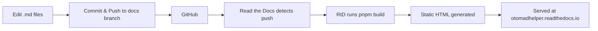

@en # Revise _Otomad Helper_ Documentation
@zh # 修订_音MAD助手_说明文档

@en Welcome to revise the documentation for **Otomad Helper** — a YTPMV/otoMAD/YTP extension for Vegas Pro. This site serves documentation for both the **new version (v8, an extension)** and the **old version (v4, a script)**.
@zh Welcome to revise the documentation for **Otomad Helper** — a YTPMV/otoMAD/YTP extension for Vegas Pro. This site serves documentation for both the **new version (v8, an extension)** and the **old version (v4, a script)**.

@en ## Project Overview
@zh ## Project Overview

@en Otomad Helper is a tool that enables Vegas Pro to accept scores (such as MIDI sequence files) as input and automatically generate YTPMV/otoMAD/YTP tracks. This repository contains the **documentation website** source code for the project.
@zh Otomad Helper is a tool that enables Vegas Pro to accept scores (such as MIDI sequence files) as input and automatically generate YTPMV/otoMAD/YTP tracks. This repository contains the **documentation website** source code for the project.

@en The documentation covers two major versions:
@zh The documentation covers two major versions:

@en | Version | Type | Description |
@zh | Version | Type | Description |
@en |---------|------|-------------|
@zh |---------|------|-------------|
@en | **v8** (New) | Extension/Custom Command | The latest version, implemented as a Vegas Pro extension (aka custom command) |
@zh | **v8** (New) | Extension/Custom Command | The latest version, implemented as a Vegas Pro extension (aka custom command) |
@en | **v4** (Old) | Script | The legacy version, implemented as a Vegas Pro script |
@zh | **v4** (Old) | Script | The legacy version, implemented as a Vegas Pro script |

@en ## Tech Stack
@zh ## Tech Stack

@en | Component | Technology |
@zh | Component | Technology |
@en |-----------|-----------|
@zh |-----------|-----------|
@en | **Documentation Framework** | [VitePress](https://vitepress.dev/) (v2) |
@zh | **Documentation Framework** | [VitePress](https://vitepress.dev/) (v2) |
@en | **Package Manager** | [pnpm](https://pnpm.io/) |
@zh | **Package Manager** | [pnpm](https://pnpm.io/) |
@en | **Source Hosting** | [GitHub](https://github.com/otomad/OtomadHelper) (branch: `docs`) |
@zh | **Source Hosting** | [GitHub](https://github.com/otomad/OtomadHelper) (branch: `docs`) |
@en | **Build & Hosting** | [Read the Docs](https://readthedocs.org/) |
@zh | **Build & Hosting** | [Read the Docs](https://readthedocs.org/) |
@en | **Custom Plugins** | i18n-macro, KaTeX math, image preview, pagefind search, RSS feeds, llms.txt, etc. |
@zh | **Custom Plugins** | i18n-macro, KaTeX math, image preview, pagefind search, RSS feeds, llms.txt, etc. |

@en **How it works:** When code is pushed to the `docs` branch on GitHub, Read the Docs automatically rebuilds the site and serves the static HTML pages at [https://otomadhelper.readthedocs.io/](https://otomadhelper.readthedocs.io/).
@zh **How it works:** When code is pushed to the `docs` branch on GitHub, Read the Docs automatically rebuilds the site and serves the static HTML pages at [https://otomadhelper.readthedocs.io/](https://otomadhelper.readthedocs.io/).

@en ## Multi-Language Documentation Format
@zh ## Multi-Language Documentation Format

@en This project uses a custom **single-file multi-language** format. Instead of maintaining separate files for each language, all translations live together in one file. This makes it much easier to spot and fix errors across languages simultaneously.
@zh This project uses a custom **single-file multi-language** format. Instead of maintaining separate files for each language, all translations live together in one file. This makes it much easier to spot and fix errors across languages simultaneously.

@en ### Why This Format?
@zh ### Why This Format?

@en If the document contains 7 languages, when you need to fix a mistake that exists in multiple languages, the traditional approach requires you to:
@zh If the document contains 7 languages, when you need to fix a mistake that exists in multiple languages, the traditional approach requires you to:

@en 1. Open 7 separate files (one per language).
@zh 1. Open 7 separate files (one per language).
@en 2. Find the corresponding line in each file.
@zh 2. Find the corresponding line in each file.
@en 3. Make the same fix 7 times.
@zh 3. Make the same fix 7 times.

@en With the single-file format, translations sit right next to each other, so you can fix everything in one place.
@zh With the single-file format, translations sit right next to each other, so you can fix everything in one place.

@en ### Line-Level Multi-Language
@zh ### Line-Level Multi-Language

@en For translating individual lines, use the **`@` prefix** followed by a language tag, a space, and the translated content:
@zh For translating individual lines, use the **`@` prefix** followed by a language tag, a space, and the translated content:

@en ```markdown
@zh ```markdown
@en \@en This is English content.
@zh \@en This is English content.
@en \@zh 这是中文内容。
@zh \@zh 这是中文内容。
@en \@ja これは日本語の内容です。
@zh \@ja これは日本語の内容です。
@en ```
@zh ```

@en Currently supported language tags: `en` (English), `zh` (Simplified Chinese).
@zh Currently supported language tags: `en` (English), `zh` (Simplified Chinese).

@en ### Block-Level Multi-Language
@zh ### Block-Level Multi-Language

@en For large blocks of content — such as entire paragraphs with complex formatting, tables, or admonition blocks — use **`@@@` delimiters**:
@zh For large blocks of content — such as entire paragraphs with complex formatting, tables, or admonition blocks — use **`@@@` delimiters**:

@en ```markdown
@zh ```markdown
@en \@@@en
@zh \@@@en
@en This is a large block of English content.
@zh This is a large block of English content.
@en It can span multiple lines and include **formatting**.
@zh It can span multiple lines and include **formatting**.
@en \@@@zh
@zh \@@@zh
@en 这是一大段中文内容。
@zh 这是一大段中文内容。
@en 它可以跨越多行并包含**格式**。
@zh 它可以跨越多行并包含**格式**。
@en \@@@
@zh \@@@
@en ```
@zh ```

@en - Start a block with `@@@` followed by a language tag.
@zh - Start a block with `@@@` followed by a language tag.
@en - End the **entire** multi-language block with a bare `@@@` on its own line.
@zh - End the **entire** multi-language block with a bare `@@@` on its own line.

@en ### Fallback Behavior
@zh ### Fallback Behavior

@en If a particular language is missing for a line or block, the site will automatically **fall back to English**. This means you only need to write translations for languages you know — missing ones will safely display English instead.
@zh If a particular language is missing for a line or block, the site will automatically **fall back to English**. This means you only need to write translations for languages you know — missing ones will safely display English instead.

@en ### Important Rules
@zh ### Important Rules

@en - **Do not** mix line-level (`@`) and block-level (`@@@`) syntax for the same content — pick one.
@zh - **Do not** mix line-level (`@`) and block-level (`@@@`) syntax for the same content — pick one.
@en - The `@` or `@@@` markers must appear at the very beginning of a line.
@zh - The `@` or `@@@` markers must appear at the very beginning of a line.
@en - For line-level translations, languages can appear in any order, but keeping them consistent (e.g., always `@en` first, then `@zh`) helps readability.
@zh - For line-level translations, languages can appear in any order, but keeping them consistent (e.g., always `@en` first, then `@zh`) helps readability.

@en ## How to Edit Documentation
@zh ## How to Edit Documentation

@en The steps below are written for **non-programmers**. You do not need any coding experience — just follow along step by step. If you get stuck, ask a friend who is familiar with computers to help.
@zh The steps below are written for **non-programmers**. You do not need any coding experience — just follow along step by step. If you get stuck, ask a friend who is familiar with computers to help.

@en > ⚠️ **Important:** All documentation changes should be made on the **`docs`** branch, not the `main`/`master` branch.
@zh > ⚠️ **Important:** All documentation changes should be made on the **`docs`** branch, not the `main`/`master` branch.

@en ### One-Time Setup
@zh ### One-Time Setup

@en You only need to do this section **once**, the first time you set up the project on your computer.
@zh You only need to do this section **once**, the first time you set up the project on your computer.

@en ---
@zh ---

@en #### Step 1: Install Node.js
@zh #### Step 1: Install Node.js

@en Node.js is the runtime that powers the documentation toolchain.
@zh Node.js is the runtime that powers the documentation toolchain.

@en 1. Open your browser and go to **[https://nodejs.org/](https://nodejs.org/)**
@zh 1. Open your browser and go to **[https://nodejs.org/](https://nodejs.org/)**
@en 2. Click the **LTS** (Long Term Support) download button — this is the stable version recommended for most users.
@zh 2. Click the **LTS** (Long Term Support) download button — this is the stable version recommended for most users.
@en 3. Once downloaded, double-click the installer file (e.g., `node-vXX.XX.X-x64.msi` on Windows).
@zh 3. Once downloaded, double-click the installer file (e.g., `node-vXX.XX.X-x64.msi` on Windows).
@en 4. Follow the installation wizard — you can accept all the default settings.
@zh 4. Follow the installation wizard — you can accept all the default settings.
@en 5. Click **Finish** when done.
@zh 5. Click **Finish** when done.

@en > ✅ To verify it's installed: Open the Start Menu, type `cmd`, press <kbd>Enter</kbd> to open Command Prompt, then type `node --version`. If you see a version number (e.g., `v22.x.x`), you're all set.
@zh > ✅ To verify it's installed: Open the Start Menu, type `cmd`, press <kbd>Enter</kbd> to open Command Prompt, then type `node --version`. If you see a version number (e.g., `v22.x.x`), you're all set.

@en ---
@zh ---

@en #### Step 2: Install pnpm
@zh #### Step 2: Install pnpm

@en pnpm is the package manager used by this project.
@zh pnpm is the package manager used by this project.

@en 1. Open **Command Prompt** (Start Menu → type `cmd` → press <kbd>Enter</kbd>).
@zh 1. Open **Command Prompt** (Start Menu → type `cmd` → press <kbd>Enter</kbd>).
@en 2. Type the following command and press <kbd>Enter</kbd>:
@zh 2. Type the following command and press <kbd>Enter</kbd>:
@en    ```bash
@zh    ```bash
@en    npm install -g pnpm
@zh    npm install -g pnpm
@en    ```
@zh    ```
@en 3. Wait for the installation to complete.
@zh 3. Wait for the installation to complete.

@en > ✅ To verify: type `pnpm --version` in Command Prompt. You should see a version number.
@zh > ✅ To verify: type `pnpm --version` in Command Prompt. You should see a version number.

@en ---
@zh ---

@en #### Step 3: Install GitHub Desktop
@zh #### Step 3: Install GitHub Desktop

@en GitHub Desktop provides a visual interface for Git, _so you don't need to memorize command-line instructions._
@zh GitHub Desktop provides a visual interface for Git, _so you don't need to memorize command-line instructions._

@en 1. Go to **[https://desktop.github.com/](https://desktop.github.com/)**
@zh 1. Go to **[https://desktop.github.com/](https://desktop.github.com/)**
@en 2. Click the **Download** button.
@zh 2. Click the **Download** button.
@en 3. Once downloaded, run the installer.
@zh 3. Once downloaded, run the installer.
@en 4. When you open GitHub Desktop for the first time, it will ask you to sign in with your GitHub account. If you don't have one:
@zh 4. When you open GitHub Desktop for the first time, it will ask you to sign in with your GitHub account. If you don't have one:
@en    - Go to **[https://github.com/signup](https://github.com/signup)** and create a free account.
@zh    - Go to **[https://github.com/signup](https://github.com/signup)** and create a free account.
@en    - Then sign in to GitHub Desktop with your new account.
@zh    - Then sign in to GitHub Desktop with your new account.
@en 5. Follow the setup prompts (you can skip configuring Git if asked — the defaults are fine).
@zh 5. Follow the setup prompts (you can skip configuring Git if asked — the defaults are fine).

@en ---
@zh ---

@en #### Step 4: Clone the Repository
@zh #### Step 4: Clone the Repository

@en "Cloning" means downloading a copy of the project to your computer.
@zh "Cloning" means downloading a copy of the project to your computer.

@en 1. In **GitHub Desktop**, click **File → Clone repository...**
@zh 1. In **GitHub Desktop**, click **File → Clone repository...**
@en 2. Select the **URL** tab.
@zh 2. Select the **URL** tab.
@en 3. In the "Repository URL" field, enter:
@zh 3. In the "Repository URL" field, enter:
@en    ```
@zh    ```
@en    https://github.com/otomad/OtomadHelper
@zh    https://github.com/otomad/OtomadHelper
@en    ```
@zh    ```
@en 4. For "Local path", click **Choose...** and pick a folder on your computer where you want to store the project (e.g., `D:\Documents\OtomadHelper`).
@zh 4. For "Local path", click **Choose...** and pick a folder on your computer where you want to store the project (e.g., `D:\Documents\OtomadHelper`).
@en 5. Click **Clone**.
@zh 5. Click **Clone**.
@en 6. **Important:** After cloning, switch to the `docs` branch:
@zh 6. **Important:** After cloning, switch to the `docs` branch:
@en    - Near the top of GitHub Desktop, you'll see a button labeled **"Current branch"** (it may say `main` or `master`).
@zh    - Near the top of GitHub Desktop, you'll see a button labeled **"Current branch"** (it may say `main` or `master`).
@en    - Click it, then select the **`docs`** branch from the list.
@zh    - Click it, then select the **`docs`** branch from the list.
@en    - If you don't see `docs` in the list, click the **"Origin"** tab at the top of the branch list — branches that only exist on GitHub will appear there. Click `docs` to check it out.
@zh    - If you don't see `docs` in the list, click the **"Origin"** tab at the top of the branch list — branches that only exist on GitHub will appear there. Click `docs` to check it out.

@en ---
@zh ---

@en #### Step 5: Install Project Dependencies
@zh #### Step 5: Install Project Dependencies

@en Dependencies are external libraries the project needs to work.
@zh Dependencies are external libraries the project needs to work.

@en 1. In **GitHub Desktop**, with the repository open, click **Repository → Open in Terminal** (or press <kbd>Ctrl</kbd> + <kbd>`</kbd>).
@zh 1. In **GitHub Desktop**, with the repository open, click **Repository → Open in Terminal** (or press <kbd>Ctrl</kbd> + <kbd>`</kbd>).
@en    - This opens a terminal window already pointing to the project folder.
@zh    - This opens a terminal window already pointing to the project folder.
@en 2. In the terminal, type the following and press <kbd>Enter</kbd>:
@zh 2. In the terminal, type the following and press <kbd>Enter</kbd>:
@en    ```bash
@zh    ```bash
@en    pnpm i
@zh    pnpm i
@en    ```
@zh    ```
@en 3. Wait for the installation to finish — it may take a minute or two. You'll see a progress indicator, and it will end with something like "Done".
@zh 3. Wait for the installation to finish — it may take a minute or two. You'll see a progress indicator, and it will end with something like "Done".

@en > You only need to run `pnpm i` once during setup. You generally don't need to run it again unless someone tells you new dependencies were added.
@zh > You only need to run `pnpm i` once during setup. You generally don't need to run it again unless someone tells you new dependencies were added.

@en ---
@zh ---

@en #### Step 6 *(Not Necessary, But Recommended)*: Install Visual Studio Code
@zh #### Step 6 *(Not Necessary, But Recommended)*: Install Visual Studio Code

@en While you can edit files with **Notepad** directly, *Visual Studio Code (VS Code)* is a free, powerful editor that makes editing much easier with syntax highlighting and file browsing.
@zh While you can edit files with **Notepad** directly, *Visual Studio Code (VS Code)* is a free, powerful editor that makes editing much easier with syntax highlighting and file browsing.

@en 1. Go to **[https://code.visualstudio.com/](https://code.visualstudio.com/)**
@zh 1. Go to **[https://code.visualstudio.com/](https://code.visualstudio.com/)**
@en 2. Click **Download** and install it (accept all defaults).
@zh 2. Click **Download** and install it (accept all defaults).
@en 3. After installation, in **GitHub Desktop**, you can right-click the repository and choose **"Open in Visual Studio Code"** to jump straight into editing.
@zh 3. After installation, in **GitHub Desktop**, you can right-click the repository and choose **"Open in Visual Studio Code"** to jump straight into editing.

@en ---
@zh ---

@en ### Daily Editing Workflow
@zh ### Daily Editing Workflow

@en This is the workflow you'll follow **each time** you want to make changes.
@zh This is the workflow you'll follow **each time** you want to make changes.

@en ---
@zh ---

@en #### Step 1: Pull the Latest Changes
@zh #### Step 1: Pull the Latest Changes

@en Before editing, always fetch the latest version to avoid conflicts with changes others may have made.
@zh Before editing, always fetch the latest version to avoid conflicts with changes others may have made.

@en 1. Open **GitHub Desktop**.
@zh 1. Open **GitHub Desktop**.
@en 2. Make sure the current repository is **OtomadHelper** and the current branch is **`docs`**.
@zh 2. Make sure the current repository is **OtomadHelper** and the current branch is **`docs`**.
@en 3. Click the **"Fetch origin"** button in the top toolbar.
@zh 3. Click the **"Fetch origin"** button in the top toolbar.
@en 4. If there are new changes, the button will change to **"Pull origin"** — click it to download the latest updates.
@zh 4. If there are new changes, the button will change to **"Pull origin"** — click it to download the latest updates.

@en > 💡 **Tip:** Always do this before you start editing. It prevents the frustration of having your work overwritten by someone else's changes.
@zh > 💡 **Tip:** Always do this before you start editing. It prevents the frustration of having your work overwritten by someone else's changes.

@en ---
@zh ---

@en #### Step 2: Edit Documentation Files
@zh #### Step 2: Edit Documentation Files

@en The documentation files are Markdown (`.md`) files located in the `docs/` folder.
@zh The documentation files are Markdown (`.md`) files located in the `docs/` folder.

@en 1. Open the project folder in your file explorer, or open it in **VS Code**.
@zh 1. Open the project folder in your file explorer, or open it in **VS Code**.
@en 2. Navigate to the `docs/` folder. Inside you'll find:
@zh 2. Navigate to the `docs/` folder. Inside you'll find:
@en    - **`.vitepress/`** — Configuration and theme files (usually you won't touch these)
@zh    - **`.vitepress/`** — Configuration and theme files (usually you won't touch these)
@en    - **`zh-CN/**/*.md`** — Chinese-specific pages (home page, etc.)
@zh    - **`zh-CN/**/*.md`** — Chinese-specific pages (home page, etc.)
@en    - **`**/*.md` files** — The new v8 extension version documentation pages (these use the [multi-language format](#multi-language-documentation-format))
@zh    - **`**/*.md` files** — The new v8 extension version documentation pages (these use the [multi-language format](#multi-language-documentation-format))
@en    - **`v4/**/*.md`** — the old v4 script version documentation pages (these use the [multi-language format](#multi-language-documentation-format))
@zh    - **`v4/**/*.md`** — the old v4 script version documentation pages (these use the [multi-language format](#multi-language-documentation-format))
@en 3. Open the file you want to edit. Most content files use the single-file multi-language format, so English and Chinese content sit together. See the [Multi-Language Documentation Format](#multi-language-documentation-format) section above for details.
@zh 3. Open the file you want to edit. Most content files use the single-file multi-language format, so English and Chinese content sit together. See the [Multi-Language Documentation Format](#multi-language-documentation-format) section above for details.
@en 4. Make your changes and save the file (`Ctrl+S`).
@zh 4. Make your changes and save the file (`Ctrl+S`).

@en > 📝 **What to edit:**
@zh > 📝 **What to edit:**
@en > - To fix a typo or error: find the `@en` line and edit it. The corresponding `@zh` line(s) are right below.
@zh > - To fix a typo or error: find the `@en` line and edit it. The corresponding `@zh` line(s) are right below.
@en > - To add a new section: write `@en Your English text` followed by `@zh 你的中文文本` for each paragraph.
@zh > - To add a new section: write `@en Your English text` followed by `@zh 你的中文文本` for each paragraph.
@en > - For large blocks (warnings, tables, etc.), use the `@@@en` / `@@@zh` / `@@@` block format.
@zh > - For large blocks (warnings, tables, etc.), use the `@@@en` / `@@@zh` / `@@@` block format.

@en ---
@zh ---

@en #### Step 3: Preview Your Changes Locally
@zh #### Step 3: Preview Your Changes Locally

@en Before pushing, you can preview the site on your own computer to see how your changes look.
@zh Before pushing, you can preview the site on your own computer to see how your changes look.

@en 1. If you have **VS Code**, please Press <kbd>Ctrl</kbd> + <kbd>Shift</kbd> + <kbd>B</kbd>, and then select `npm: dev`.
@zh 1. If you have **VS Code**, please Press <kbd>Ctrl</kbd> + <kbd>Shift</kbd> + <kbd>B</kbd>, and then select `npm: dev`.
@en    > If you don't have VS Code, please:
@zh    > If you don't have VS Code, please:
@en    > 1. Open a terminal in the project folder:\
@zh    > 1. Open a terminal in the project folder:\
@en    >    **In GitHub Desktop:** Click **Repository → Open in Terminal**.
@zh    >    **In GitHub Desktop:** Click **Repository → Open in Terminal**.
@en    > 2. Type this command and press <kbd>Enter</kbd>:
@zh    > 2. Type this command and press <kbd>Enter</kbd>:
@en    >    ```bash
@zh    >    ```bash
@en    >    pnpm run dev
@zh    >    pnpm run dev
@en    >    ```
@zh    >    ```
@en 2. Wait a moment. You'll see output like:
@zh 2. Wait a moment. You'll see output like:
@en    ```
@zh    ```
@en    vitepress vX.X.X
@zh    vitepress vX.X.X
@en    ➜  Local:   http://localhost:7000/
@zh    ➜  Local:   http://localhost:7000/
@en    ```
@zh    ```
@en 3. Press <kbd>Ctrl</kbd> (or maybe <kbd>Alt</kbd>) and click the link **`http://localhost:7000/`**.
@zh 3. Press <kbd>Ctrl</kbd> (or maybe <kbd>Alt</kbd>) and click the link **`http://localhost:7000/`**.
@en 4. Navigate to the page(s) you edited and check that everything looks correct.
@zh 4. Navigate to the page(s) you edited and check that everything looks correct.

@en > 💡 **Tip:** The preview updates automatically as you save files — just save in your editor and refresh the browser.
@zh > 💡 **Tip:** The preview updates automatically as you save files — just save in your editor and refresh the browser.

@en ---
@zh ---

@en #### Step 4: Commit and Push Your Changes
@zh #### Step 4: Commit and Push Your Changes

@en "Committing" saves your changes to the local repository. "Pushing" uploads them to GitHub.
@zh "Committing" saves your changes to the local repository. "Pushing" uploads them to GitHub.

@en 1. Open **GitHub Desktop**. You'll see your changed files listed on the left.
@zh 1. Open **GitHub Desktop**. You'll see your changed files listed on the left.
@en 2. In the bottom-left corner, find the **"Summary"** field. Write a short, clear description of what you changed. For example:
@zh 2. In the bottom-left corner, find the **"Summary"** field. Write a short, clear description of what you changed. For example:
@en    - `Fix typo in installation guide`
@zh    - `Fix typo in installation guide`
@en    - `Update audio page with new feature description`
@zh    - `Update audio page with new feature description`
@en    - `Add Chinese translation for FAQ page`
@zh    - `Add Chinese translation for FAQ page`
@en 3. Optionally, you can add more details in the **"Description"** field below.
@zh 3. Optionally, you can add more details in the **"Description"** field below.
@en 4. Click the **"Commit to docs"** button.
@zh 4. Click the **"Commit to docs"** button.
@en 5. After committing, click the **"Push origin"** button (top right) to upload your changes to GitHub.
@zh 5. After committing, click the **"Push origin"** button (top right) to upload your changes to GitHub.

@en > 🎉 That's it! Once pushed, Read the Docs will automatically rebuild the site within a few minutes. You can check the live site at [https://otomadhelper.readthedocs.io/](https://otomadhelper.readthedocs.io/).
@zh > 🎉 That's it! Once pushed, Read the Docs will automatically rebuild the site within a few minutes. You can check the live site at [https://otomadhelper.readthedocs.io/](https://otomadhelper.readthedocs.io/).

@en ## Project Structure
@zh ## Project Structure

```
OtomadHelper_docs/                     # Repository root (docs branch)
├── .gitignore                         # Files ignored by Git
├── .readthedocs.yaml                  # Read the Docs build configuration
├── package.json                       # Project dependencies and scripts
├── pnpm-lock.yaml                     # Dependency version lock file
├── tsconfig.json                      # TypeScript configuration
├── oxfmt.config.ts                    # Code formatter configuration
├── README.md                          # You are here
├── README_zh-CN.md                    # Chinese version of this file
└── docs/                              # Documentation source (VitePress root)
    ├── .vitepress/                    # VitePress configuration & theme
    │   ├── config.ts                  # Main site configuration
    │   ├── components/                # Custom Vue components
    │   ├── plugins/                   # Custom Markdown & build plugins
    │   ├── theme/                     # Custom theme overrides
    │   └── use-i18n.ts                # Internationalization helpers
    ├── assets/                        # Static assets (images, fonts, etc.)
    ├── img/                           # Documentation images
    ├── public/                        # Public static files
    │   ├── favicon.svg                # Site favicon
    │   └── favicon_1.ico              # Alternative favicon (RtD workaround)
    ├── index.md                       # Home page (English)
    ├── introduction.md                # Introduction page (multi-language)
    ├── installation.md                # Installation guide (multi-language)
    ├── usage.md                       # Usage guide (multi-language)
    ├── faq.md                         # FAQ (multi-language)
    ├── audio.md, visual.md, ...       # Feature pages (multi-language)
    ├── v4/                            # Old v4 documentation pages
    │   ├── introduction.md
    │   ├── installation.md
    │   └── ...
    └── zh-CN/                         # Chinese-specific pages
        ├── index.md                   # Home page (Chinese)
        └── v4/                        # Chinese v4 entry point
```

@en ## How Build & Deployment Works
@zh ## How Build & Deployment Works



@en 1. You edit Markdown files and push to the `docs` branch on GitHub.
@zh 1. You edit Markdown files and push to the `docs` branch on GitHub.
@en 2. Read the Docs automatically detects the push.
@zh 2. Read the Docs automatically detects the push.
@en 3. RtD runs `npm run build` (configured in `.readthedocs.yaml`), which builds the VitePress site.
@zh 3. RtD runs `npm run build` (configured in `.readthedocs.yaml`), which builds the VitePress site.
@en 4. The generated static HTML files are served at [https://otomadhelper.readthedocs.io/](https://otomadhelper.readthedocs.io/).
@zh 4. The generated static HTML files are served at [https://otomadhelper.readthedocs.io/](https://otomadhelper.readthedocs.io/).
@en 5. The build usually completes within **2–5 minutes** after pushing.
@zh 5. The build usually completes within **2–5 minutes** after pushing.

@en ### Available Scripts
@zh ### Available Scripts

@en | Command | Description |
@zh | Command | Description |
@en |---------|-------------|
@zh |---------|-------------|
@en | `pnpm run dev` | Start a local preview server at `http://localhost:7000/` |
@zh | `pnpm run dev` | Start a local preview server at `http://localhost:7000/` |
@en | `pnpm run build` | Build the static site for production |
@zh | `pnpm run build` | Build the static site for production |
@en | `pnpm run preview` | Preview the production build locally |
@zh | `pnpm run preview` | Preview the production build locally |
@en | `pnpm run fmt` | Format code with oxfmt |
@zh | `pnpm run fmt` | Format code with oxfmt |

@en ## License
@zh ## License

@en This documentation is released under the [GPL 3.0 License](https://www.gnu.org/licenses/gpl-3.0.html).
@zh This documentation is released under the [GPL 3.0 License](https://www.gnu.org/licenses/gpl-3.0.html).

@en Copyright © 2021–present
@zh Copyright © 2021–present
