# Glossary
> Some pictures come from the Internet, please contect to delete if there is any infringement.
<!-- Example Accent Color: #8daee6 -->

## Modes 模式 模式 モード
<table>
	<thead>
		<th>Name</th>
		<th>Sketch</th>
		<th>Icon</th>
	</thead>
	<tbody>
		<tr>
			<td>Otomad / YTPMV 
			音 MAD / YTPMV 
			音声 Music Anime Douga / YouTube Poop Music Video</td>
			<td><a href="#">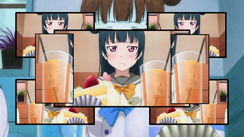</a></td>
			<td></td>
		</tr>
		<tr>
			<td>YTP 
			YouTube Poop</td>
			<td><a href="#">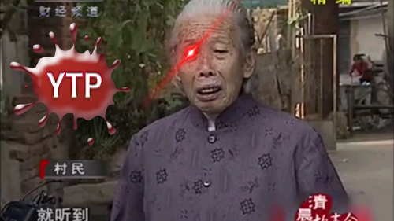</a></td>
			<td></td>
		</tr>
		<tr>
			<td>Sonar Effect 
			声呐效果 
			聲呐效果 
			ソナー効果</td>
			<td><a href="#">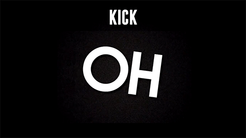</a></td>
			<td></td>
		</tr>
		<tr>
			<td>Lyrics / Karaoke 
			歌词 / 卡拉 OK 
			歌詞 / 卡拉 OK 
			歌詞 / カラオケ</td>
			<td><a href="#">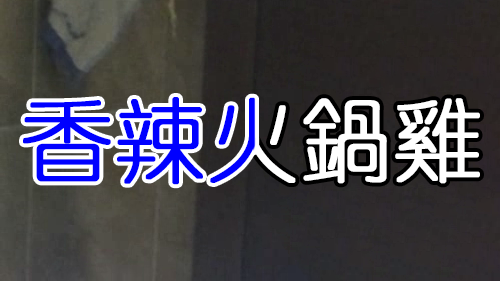</a></td>
			<td></td>
		</tr>
		<tr>
			<td>Manual Vocaloid / Sentence Mixing 
			人力 / Rap 
			ボカロ / 鬼畜</td>
			<td></td>
			<td></td>
		</tr>
		<tr>
			<td>Shupelunker Tactics 
			原音系战法 
			原音系戰法 
			シュペランカー戦法</td>
			<td></td>
			<td></td>
		</tr>
	</tbody>
</table>

## Switches 开关 開關 スイッチ
<table>
	<tr>
		<td>Stretch 
			拉伸 
			拉伸 
			ストレッチ</td>
		<td><a href="#">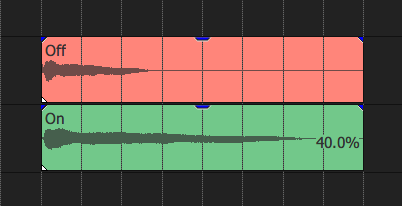</a></td>
	</tr>
	<tr>
		<td>Loop 
			循环 
			循環 
			ループ</td>
		<td><a href="#">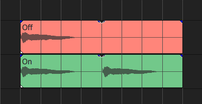</a></td>
	</tr>
	<tr>
		<td>No Lengthening / Freeze Last Frame 
			禁止延长 / 定格尾帧 
			禁止延長 / 定格尾幀 
			延長しない</td>
		<td><a href="#">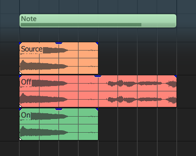</a></td>
	</tr>
	<tr>
		<td colspan="2"><b><i>Remark:</i></b>
		After checking, if the trimmed clip selected in the track window is shorter than the MIDI note, it will not be extended. If it is a video clip, it will be frozen at the last frame of the source clip length.</td>
	</tr>
	<tr>
		<td>Create Groups 
			创建分组 
			創建分組 
			グループの作成</td>
		<td><a href="#">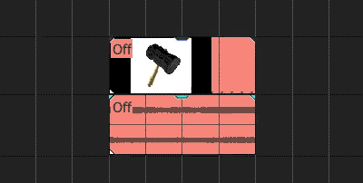</a></td>
	</tr>
	<tr>
		<td colspan="2"><b><i>Remark:</i></b>
		After checking, The generated associated audio and video clips will create a group, or be bound together. Then it will be easier to change the position or length simultaneously.</td>
	</tr>
	<tr>
		<td>Audio - Normalize 
			音频 - 规范化音量 
			音訊 - 規範化音量 
			オーディオ - ノーマライズ</td>
		<td><a href="#">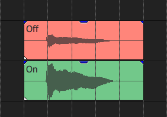</a></td>
	</tr>
	<tr>
		<td>Video - Static Visual / Freeze First Frame 
			视频 - 静态画面 / 定格首帧 
			視訊 - 靜態畫面 / 定格首幀 
			ビデオ - 静止画像</td>
		<td></td>
	</tr>
	<tr>
		<td colspan="2"><b><i>Remark:</i></b>
		After checking, the video will freeze at the first frame.</td>
	</tr>
	<tr>
		<td>Video - Multitrack for Chords 
			视频 - 复音多轨 
			視訊 - 複音多軌 
			ビデオ - 和音の複数トラック</td>
		<td><a href="#">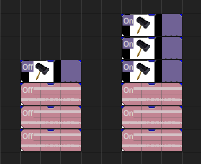</a></td>
	</tr>
</table>

## Legato (Property) 填补间隙 / 连奏（属性） 填補間隙 / 連奏（内容） レガート（プロパティ）
<table>
	<tr>
		<td>Staccato 
			不填补 / 断奏 
			不填補 / 斷奏 
			スタッカート</td>
		<td></td>
	</tr>
	<tr>
		<td>1 Beat Longest 
			最长一拍 
			最長一拍 
			最長 1 ビート</td>
		<td></td>
	</tr>
	<tr>
		<td>1 Bar Longest 
			最长一小节 
			最長一小節 
			最長 1 バー</td>
		<td></td>
	</tr>
	<tr>
		<td>Unlimited 
			无限填补 
			無限填補 
			無制限</td>
		<td></td>
	</tr>
</table>

## Tracks Legato (Tool) 填补轨道间隙（工具） 填補軌道間隙（工具） ラックの間隙を埋める（ツール）
<table>
	<thead>
		<th>Main Affix</th>
		<th>Minor Affix</th>
		<th>Forward Direction</th>
		<th>Reverse Direction</th>
	</thead>
	<tbody>
		<tr>
			<td rowspan="4">Stacking Clips</td>
			<td>for Current Tracks</td>
			<td><a href="#">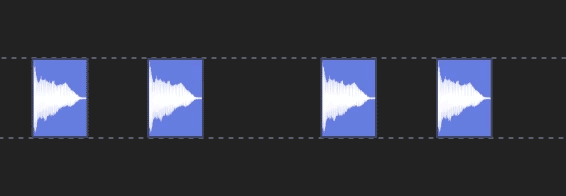</a></td>
			<td></td>
		</tr>
		<tr>
			<td>for All Tracks</td>
			<td></td>
			<td></td>
		</tr>
		<tr>
			<td>for Selected Clips</td>
			<td></td>
			<td></td>
		</tr>
		<tr>
			<td>for Clips All After</td>
			<td></td>
			<td></td>
		</tr>
		<tr>
			<td rowspan="2">Stretching Clips</td>
			<td>within Stretch Limits</td>
			<td><a href="#">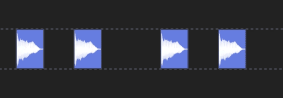</a></td>
			<td></td>
		</tr>
		<tr>
			<td><b>Lengthening when Outside Stretch Limits</b></td>
			<td><a href="#">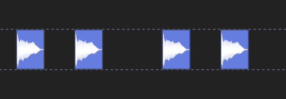</a></td>
			<td></td>
		</tr>
		<tr>
			<td>Lengthening Clips</td>
			<td>Change Clips Length</td>
			<td><a href="#">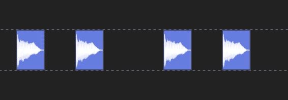</a></td>
			<td></td>
		</tr>
		<tr>
			<td rowspan="2">Increase Spacing</td>
			<td>for Current Tracks</td>
			<td></td>
			<td></td>
		</tr>
		<tr>
			<td>for All Tracks</td>
			<td></td>
			<td></td>
		</tr>
	</tbody>
	<thead>
		<th colspan="2">Apply to Selected</th>
		<th>Track</th>
		<th>Track Events</th>
	</thead>
	<tbody>
		<tr>
			<td colspan="2">Stacking Clips</td>
			<td></td>
			<td></td>
		</tr>
	</tbody>
	<thead>
		<th colspan="2">~ the Events within a Group</th>
		<th>Exclude</th>
		<th>Include</th>
	</thead>
	<tbody>
		<tr>
			<td colspan="2">Stacking Clips</td>
			<td></td>
			<td></td>
		</tr>
	</tbody>
</table>

## Curves 曲线 曲線 カーブ
> From bottom left to top right.
<table>
	<tr>
		<td>Linear 
			线性 
			線性 
			リニア</td>
		<td></td>
	</tr>
	<tr>
		<td>Fast 
			快速 
			快速 
			高速</td>
		<td></td>
	</tr>
	<tr>
		<td>Slow 
			慢速 
			慢速 
			低速</td>
		<td></td>
	</tr>
	<tr>
		<td>Smooth 
			平滑 
			平滑 
			スムーズ</td>
		<td><a href="#">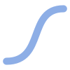</a></td>
	</tr>
	<tr>
		<td>Sharp 
			急剧 
			急劇 
			シャープ</td>
		<td></td>
	</tr>
	<tr>
		<td>Hold 
			保留 
			保留 
			ホールド</td>
		<td></td>
	</tr>
</table>

## Dynamic Tempo 动态速度 動態速度 ダイナミックテンポ
<table>
	<tr>
		<td>Hold 
			保留 
			保留 
			ホールド</td>
		<td><a href="#">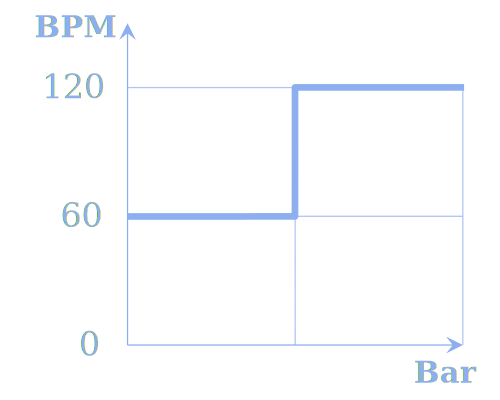</a></td>
	</tr>
	<tr>
		<td>Linear 
			线性 
			線性 
			リニア</td>
		<td><a href="#">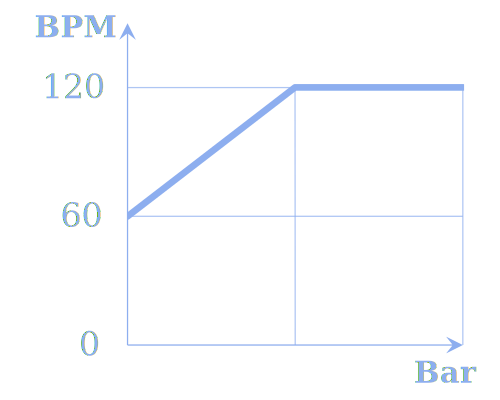</a></td>
	</tr>
</table>

## Tuning Methods 调音方法 調音方法 チューニング方法
<table>
	<tr>
		<td>No Tuning 
			不调音 
			不調音 
			チューニングなし</td>
		<td><a href="#">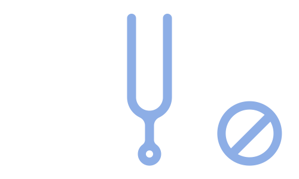</a></td>
	</tr>
	<tr>
		<td>Pitch Shift Audio Effect Plugin 
			移调效果插件 
			移調效果插件 
			ピッチシフトオーディオエフェクトプラグイン</td>
		<td><a href="#">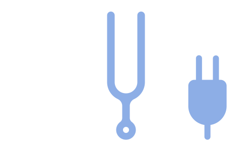</a></td>
	</tr>
	<tr>
		<td colspan="2"><b><i>Remark:</i></b>
		Use the <b>Pitch Shift</b> effect plug-in in <b>Audio FX</b> to change the pitch, which requires configuring presets. Default and the only method for <b>Vegas Pro 13~15</b>. It is also used in Otomad Helper v0.1. 
		<b><i>Advantages:</i></b>
		The pitch can be changed <b>outside</b> of -24~24. 
		<b><i>Disadvantages:</i></b>
		It requires configuring presets. And the generation is <b>very slow</b>.</td>
	</tr>
	<tr>
		<td>Elastic Pitch Change / Élastique Pitch Change / Plus & Minus Tuning / Create Valence Tuning / Soka Tuning 
			弹性音调更改 / 加减调音 / 创价调音 
			彈性音調更改 / 加減調音 / 創價調音 
			エラスティックなピッチ変化 / プラスとマイナスのチューニング / 創価チューニング</td>
		<td><a href="#">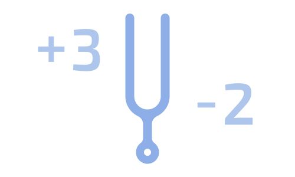</a></td>
	</tr>
	<tr>
		<td colspan="2"><b><i>Remark:</i></b>
		Use the <b>Élastique</b> time stretch and pitch shift method to change the pitch, which is the default time stretch and pitch shift method in <b>Vegas 9+</b>. Also the <b>+ and - keys</b> on the keyboard change the pitch directly. <b>Default</b> method. 
		<b><i>Advantages:</i></b>
		The generation is <b>very fast</b>. And it does not require configuring presets. 
		<b><i>Disadvantages:</i></b>
		The pitch can only be changed <b>within</b> -24~24 or <b>narrower</b> (when stretching the source clip).</td>
	</tr>
	<tr>
		<td>Classic Pitch Change 
			古典音调更改 
			古典音調更改 
			クラシックなピッチ変化</td>
		<td><a href="#">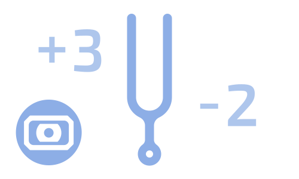</a></td>
	</tr>
	<tr>
		<td colspan="2"><b><i>Remark:</i></b>
		Use the <b>Classic</b> time stretch and pitch shift method to change the pitch, which is the default time stretch and pitch shift method in <b>Vegas 8-</b>. 
		Advantages and disadvantages are same as Elastic Pitch Change. 
		<b><i>Another disadvantages:</i></b>
		Cannot preserve formant.</td>
	</tr>
	<tr>
		<td>Acid Pitch Change 
			酸式音调更改 
			酸式音調更改 
			アシッドなピッチ変化</td>
		<td><a href="#">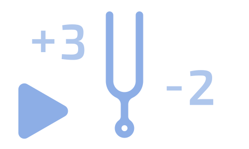</a></td>
	</tr>
	<tr>
		<td colspan="2"><b><i>Remark:</i></b>
		Use the time stretch and pitch shift method which is used in <b>Acid Pro</b>. 
		Unable to use, and forced use will report an error.</td>
	</tr>
	<tr>
		<td>Tuning without Scale 
			无音阶调音 / 瞎调音 
			無音階調音 / 瞎调音 
			スケールなしのチューニング</td>
		<td><a href="#">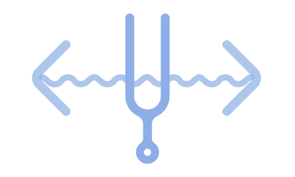</a></td>
	</tr>
	<tr>
		<td colspan="2"><b><i>Remark:</i></b>
		Inspired by a <b>time remap</b> way in After Effects. Locking the stretch and the pitch, and the clips pitch are determined according to its stretch value, following the audio resampling method. The method is just for fun and has <b>no real meaning</b>. 
		This method is actually based on Elastic Pitch Change.</td>
	</tr>
</table>

## PV Rhythm Visual Effects 映像节奏视觉效果 映像節奏視覺效果 映像リズム視覚効果

### Flip Class 翻转类 翻轉類 フリップクラス
<table>
	<tr>
		<td>Horizontal Flip 
			水平翻转 
			水平翻轉 
			水平方向にフリップ</td>
		<td><a href="#">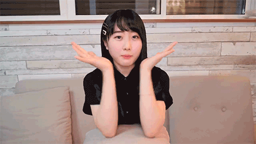</a></td>
	</tr>
	<tr>
		<td>Vertical Flip 
			垂直翻转 
			垂直翻轉 
			垂直方向にフリップ</td>
		<td></td>
	</tr>
	<tr>
		<td>Counterclockwise Flip 
			逆时针翻转 
			逆時針翻轉 
			反時計回りにフリップ</td>
		<td></td>
	</tr>
	<tr>
		<td>Clockwise Flip 
			顺时针翻转 
			順時針翻轉 
			時計回りにフリップ</td>
		<td></td>
	</tr>
</table>

> **Recommended Video Parameters Preset:** Enter

### Rotation Class 旋转类 旋轉類 回転クラス
<table>
	<tr>
		<td>Counterclockwise Rotation 
			逆时针旋转 
			逆時針旋轉 
			反時計回りの回転</td>
		<td></td>
	</tr>
	<tr>
		<td>Clockwise Rotation 
			顺时针旋转 
			順時針旋轉 
			時計回りの回転</td>
		<td></td>
	</tr>
	<tr>
		<td>Turned 
			颠倒 
			顛倒 
			向きを変えた</td>
		<td></td>
	</tr>
</table>

> **Recommended Video Parameters Preset:** Counterclockwise Rotation, Clockwise Rotation. Depending on the selected PV Rhythm Visual Effect. That is, the names selected by PV Rhythm Visual Effect and Video Parameters Preset should be the same. For Turned PV Rhythm Visual Effect, either.

### Mirror Class 镜像类 鏡像類 ミラークラス
<table>
	<tr>
		<td>Horizontal Mirror 
			水平镜像 
			水平鏡像 
			水平方向のミラー</td>
		<td><a href="https://www.youtube.com/watch?v=ZI03qpO1b-U">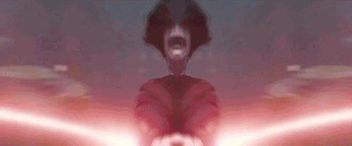</a></td>
	</tr>
	<tr>
		<td>Vertical Mirror 
			垂直镜像 
			垂直鏡像 
			垂直方向のミラー</td>
		<td></td>
	</tr>
	<tr>
		<td>Counterclockwise Mirror 
			逆时针镜像 
			逆時針鏡像 
			反時計回りのミラー</td>
		<td></td>
	</tr>
	<tr>
		<td>Clockwise Mirror 
			顺时针镜像 
			順時針鏡像 
			時計回りのミラー</td>
		<td></td>
	</tr>
</table>

### Invert Class 反转类 反轉類 反転クラス
<table>
	<tr>
		<td>Negative 
			颜色反转 
			顔色反轉 
			色を反転</td>
		<td></td>
	</tr>
	<tr>
		<td>Luminance Invert 
			亮度反转 
			亮度反轉 
			輝度を反転</td>
		<td></td>
	</tr>
</table>

### Hue Class 色相类 色相類 色相クラス
<table>
	<tr>
		<td>Hue Invert 
			色相反转 
			色相反轉 
			色相を反転</td>
		<td></td>
	</tr>
	<tr>
		<td>3~8 Steps Chromatic Aberration 
			3~8 步色差 
			3~8 步色差 
			3~8 段階色収差</td>
		<td></td>
	</tr>
</table>

### Monochrome Class 单色类 單色類 モノクロクラス
<table>
	<tr>
		<td>Chromatic and Monochrome 
			彩灰 
			彩灰 
			彩色と単色</td>
		<td></td>
	</tr>
</table>

### Time Class 时间类 時間類 時間クラス
<table>
	<tr>
		<td>Ping-pong Effect 
			乒乓效应 
			桌球效應 
			ピンポン効果</td>
		<td></td>
	</tr>
	<tr>
		<td>Whirl 
			爱的魔力转圈圈 
			愛的魔力轉圈圈 
			愛の魔力が輪回し</td>
		<td></td>
	</tr>
</table>

> **Notice:** Whirl = Ping-pong Effect + Horizontal Flip.

> **Recommended Video Parameters Preset:** Normal

### Expansion & Compression Class 扩缩类 擴縮類 拡縮クラス
<table>
	<tr>
		<td>Vertical Expansion 
			垂直扩张 
			垂直擴張 
			縦拡張</td>
		<td></td>
	</tr>
	<tr>
		<td>Vertical Expansion with Rebound 
			垂直扩张并回弹 
			垂直擴張並回彈 
			縦拡張とリバウンド</td>
		<td></td>
	</tr>
	<tr>
		<td>Vertical Compression 
			垂直压缩 
			垂直壓縮 
			縦圧縮</td>
		<td></td>
	</tr>
	<tr>
		<td>Vertical Compression with Rebound 
			垂直压缩并回弹 
			垂直壓縮並回彈 
			縦圧縮とリバウンド</td>
		<td></td>
	</tr>
	<tr>
		<td>Oblique Expansion and Compression 
			斜向扩缩 
			斜向擴縮 
			斜め拡縮</td>
		<td></td>
	</tr>
	<tr>
		<td>Puyo Pop / Puyo Puyo 
			魔法气泡 
			魔法氣泡 
			ぷよぷよ</td>
		<td></td>
	</tr>
</table>

### Swing Class 摇摆类 搖擺類 スイングクラス
<table>
	<tr>
		<td>Play Pendulum 
			左右摇摆 / 钟摆 
			左右搖擺 / 鐘擺 
			振り子</td>
		<td></td>
	</tr>
</table>

> **Recommended Video Parameters Preset:** Normal

### Blur Class 模糊类 模糊類 ブラークラス
<table>
	<tr>
		<td>Gaussian Blur 
			高斯模糊 
			高斯模糊 
			ガウスブラー</td>
		<td></td>
	</tr>
	<tr>
		<td>Radial Blur 
			径向模糊 
			徑向模糊 
			放射状ブラー</td>
		<td></td>
	</tr>
</table>

## Staff Visual Effect 五线谱视觉效果 五線譜視覺效果 五線譜視覚効果
> **Recommended Video Parameters Preset:** Enter (Staff)

## Auto Layout Tracks 自动布局轨道 自動佈局軌道 自動レイアウトトラック
<table>
	<tr>
		<td>Grid 
			网格 
			網格 
			グリッド</td>
		<td><a href="#">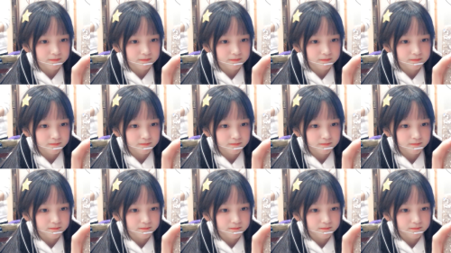</a></td>
	</tr>
	<tr>
		<td>3D Box 
			3D 方盒 
			3D 方盒 
			3D ボックス</td>
		<td><a href="#">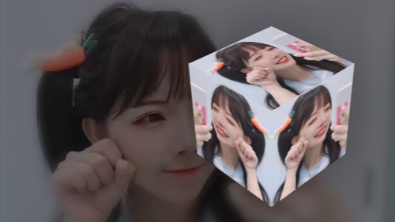</a></td>
	</tr>
</table>

## Gradient Tracks 渐变轨道 漸變軌道 グラデーショントラック
<table>
	<tr>
		<td>Rainbow Colors 
			彩虹色 
			彩虹色 
			虹色</td>
		<td><a href="#">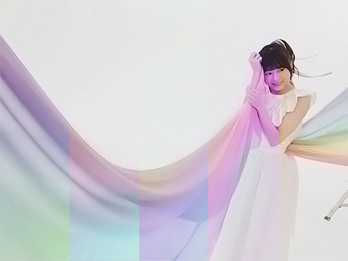</a></td>
	<tr>
		<td>Gradually Saturated 
			逐渐饱和 
			逐漸飽和 
			徐々に飽和</td>
		<td><a href="#">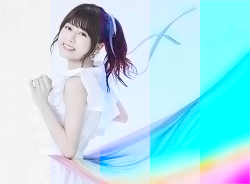</a></td>
	<tr>
		<td>Gradually Contrasted 
			逐渐对比 
			逐漸對比 
			徐々に対照</td>
		<td></td>
	<tr>
		<td>Threshold 
			阈值 
			閾值 
			スレッショルド</td>
		<td><a href="#">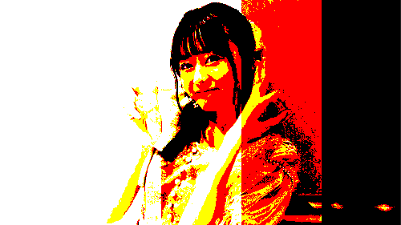</a></td>
	<tr>
		<td>Alternately Chromatic 
			彩灰交替 
			彩灰交替 
			交互にクロマチック</td>
		<td><a href="#">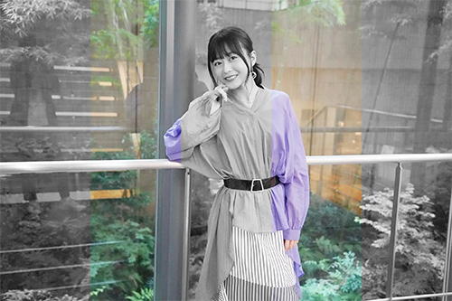</a></td>
	<tr>
		<td>Alternate Negative 
			正负交替 
			正負交替 
			交互にネガティブ</td>
		<td><a href="#">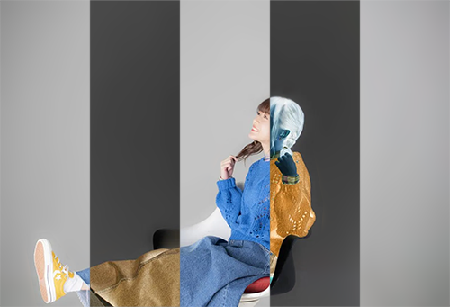</a></td>
</table>

## YTP Effects YTP 效果 YTP 效果 YTP 効果
> **Notice:**
> * *Italic / Oblique* text indicates that the effect is likely to occur.
> * **Bold** text indicates main affix.
> * For pure audio effect sketches are for **reference only**.
<table>
	<thead>
		<th>Audio</th>
		<th>Video</th>
		<th>Sketch</th>
	</thead>
	<tbody>
		<tr>
			<td><b>Chorus 
				合唱 
				合唱 
				コーラス</b></td>
			<td>-</td>
			<td></td>
		</tr>
		<tr>
			<td><b>Change Pitch 
				更改音调 
				更改音調 
				ピッチを変更</b></td>
			<td>-</td>
			<td></td>
		</tr>
		<tr>
			<td><b>Vibrato 
				颤音 
				顫音 
				ビブラート</b></td>
			<td><i>Wave 
				波浪 
				波浪 
				波浪</i></td>
			<td><a href="#">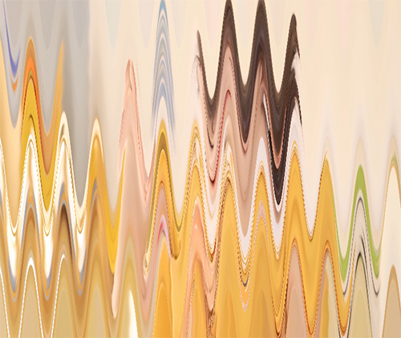</a></td>
		</tr>
		<tr>
			<td colspan="2"><b>Reverse 
				倒放 
				倒放 
				逆再生</b></td>
			<td></td>
		</tr>
		<tr>
			<td><b>Delay 
				延迟 
				延遲 
				ディレイ</b></td>
			<td>-</td>
			<td></td>
		</tr>
		<tr>
			<td colspan="2"><b>Change Speed 
				更改速度 
				更改速度 
				速度を変更</b></td>
			<td></td>
		</tr>
		<tr>
			<td>-</td>
			<td><b>Change Hue 
				更改色相 
				更改色相 
				色相を変更</b></td>
			<td><a href="#">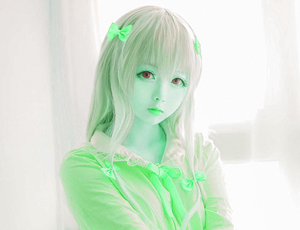</a></td>
		</tr>
		<tr>
			<td>-</td>
			<td><b>Rotate Hue 
				旋转色相 
				旋轉色相 
				色相を回転させる</b></td>
			<td></td>
		</tr>
		<tr>
			<td>-</td>
			<td><b>Monochrome 
				黑白 
				黑白 
				モノクロ</b></td>
			<td><a href="#">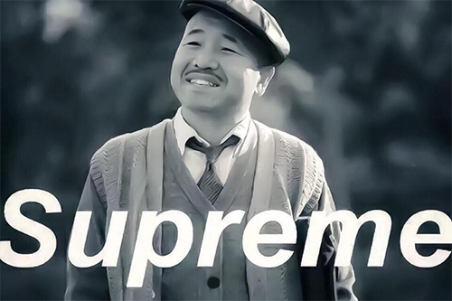</a></td>
		</tr>
		<tr>
			<td><i>Pitch-down 
				降调 
				降調 
				ピッチダウン</i></td>
			<td><b>Negative 
				颜色反转 
				顔色反轉 
				ネガティブ</b></td>
			<td><a href="#">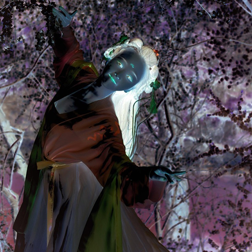</a></td>
		</tr>
		<tr>
			<td colspan="2"><b>Repeat Rapidly 
				高频重复 
				高頻重複 
				急速に繰り返す</b></td>
			<td></td>
		</tr>
		<tr>
			<td><b>Random Tuning 
				随机调音 
				隨機調音 
				ランダムチューニング</b></td>
			<td>Horizontal Flip with Rhythm 
				随旋律水平翻转 
				隨旋律水平翻轉 
				リズムのある水平方向にフリップ</td>
			<td></td>
		</tr>
		<tr>
			<td>Loud 
				增大音量 
				增大音量 
				大声</td>
			<td><b>Upsize 
				放大 
				放大 
				拡大</b></td>
			<td><a href="#">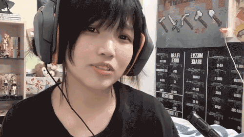</a></td>
		</tr>
		<tr>
			<td>-</td>
			<td><b>Spherize 
				球面化 
				球面化 
				球形</b></td>
			<td></td>
		</tr>
		<tr>
			<td>-</td>
			<td><b>Mirror 
				镜像 
				鏡像 
				ミラー</b></td>
			<td><a href="https://www.bilibili.com/video/av75939866">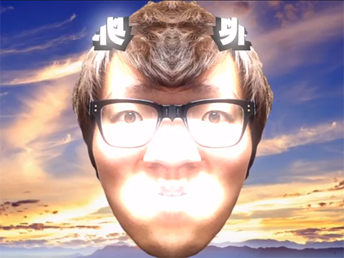</a></td>
		</tr>
		<tr>
			<td>Loud 
				增大音量 
				增大音量 
				大声</td>
			<td><b>High Contrast 
				高对比 
				高對比 
				ハイコントラスト</b></td>
			<td></td>
		</tr>
		<tr>
			<td><i>Pitch-up 
				升调 
				升調 
				ピッチアップ</i></td>
			<td><b>Oversaturation 
				过饱和 
				過飽和 
				過飽和</b></td>
			<td></td>
		</tr>
		<tr>
			<td colspan="2"><b>
				Thrice to Emphasize 
				重要的事情说三遍 
				重要的事情說三遍 
				三回強調
			</b></td>
			<td rowspan="3"></td>
		</tr>
		<tr>
			<td rowspan="2">Pitch-up or Pitch-down 
				升调或降调 
				升調或降調 
				ピッチアップまたはピッチダウン</td>
			<td>Sporadic Upsize Focus Motion 
				放大聚焦效果 
				放大聚焦效果 
				焦点を拡大効果</td>
		</tr>
		<tr>
			<td><i>Monochrome 
				黑白 
				黑白 
				モノクロ</i></td>
		</tr>
	</tbody>
</table>
